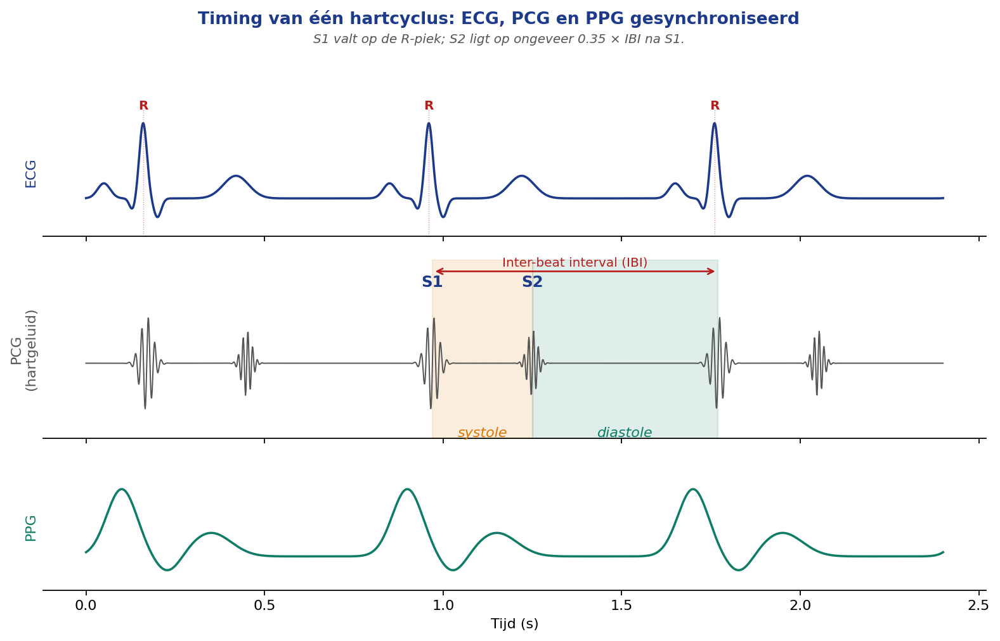
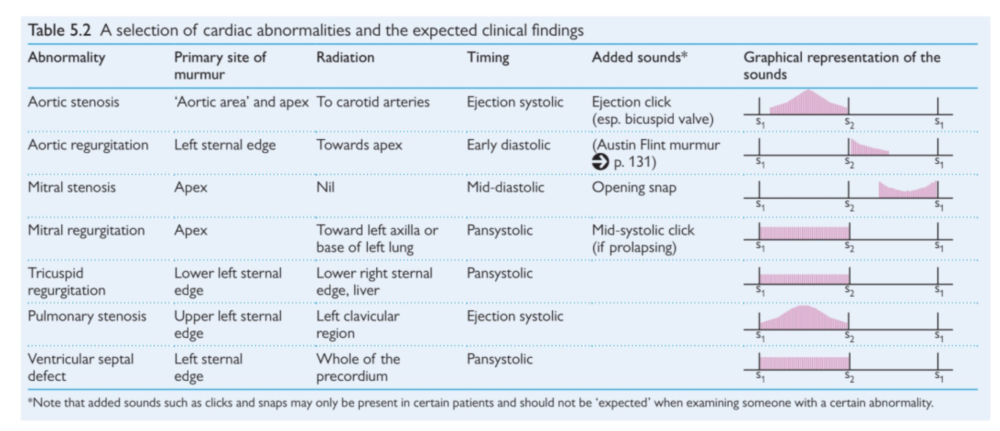
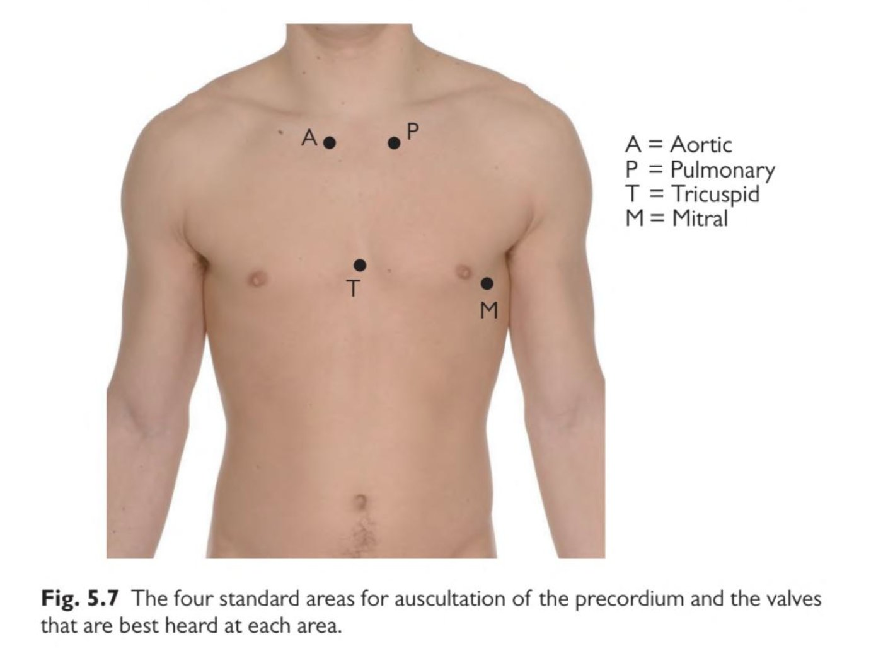
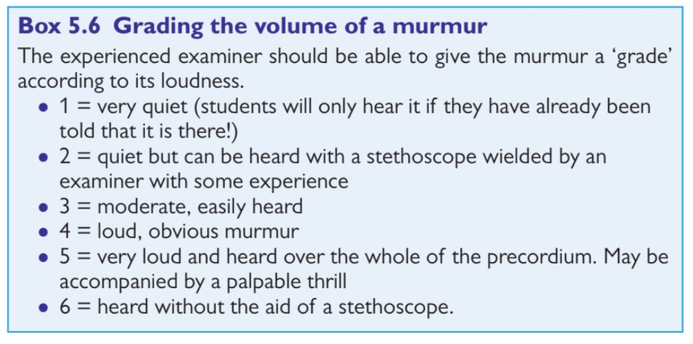

# Medical Background and State of the Art

This document provides the clinical and scientific foundation for the HeartSim project. It reviews cardiac anatomy, the physiology of normal and abnormal heart sounds, the practice of cardiac auscultation, existing training solutions, and the relevant signal-processing literature. Together, these sections establish the gap that HeartSim aims to fill and justify the key technical decisions documented in [`HeartSim-Report/02_methodology/README.md`](../02_methodology/README.md).

---

## 1. Cardiac Anatomy and the Heart Cycle

### 1.1 Anatomy of the Heart

The heart is a hollow, muscular pump composed of four chambers: the right and left atria in the upper portion, and the right and left ventricles in the lower portion. The atria receive blood from the venous system, whilst the ventricles eject it into the pulmonary and systemic circulations, respectively. Four valves regulate unidirectional flow between these chambers and their outflow tracts [1].

The valves are divided into two functional groups. The atrioventricular (AV) valves — the mitral valve on the left side and the tricuspid valve on the right — separate the atria from the ventricles and prevent backflow during ventricular contraction. The semilunar (SL) valves — the aortic valve on the left and the pulmonary valve on the right — guard the exits of the left and right ventricles, respectively. The mechanical closure of the AV valves produces the first heart sound (S1), whilst closure of the SL valves produces the second heart sound (S2). Any structural change to a valve leaflet — whether caused by calcification, rheumatic disease, or infective endocarditis — creates either an obstruction (stenosis) or a retrograde leak (regurgitation), both of which manifest as turbulent flow and an audible murmur [2], [4].

### 1.2 The Cardiac Cycle

The cardiac cycle comprises two principal phases: systole (ventricular contraction and ejection) and diastole (ventricular relaxation and filling). Pollock and Makaryus [1] describe ventricular function as a sequence of four sub-phases: isovolumic relaxation, ventricular filling, isovolumic contraction, and rapid ventricular ejection. During isovolumic contraction, the mitral valve closes (producing S1) and ventricular pressure rises until it exceeds aortic pressure; the aortic valve then opens and blood is ejected. At the end of systole, the aortic valve closes (producing S2), and diastole begins with passive ventricular filling through the re-opened mitral valve. Typical pressures in a healthy left ventricle range from approximately 15 mmHg during diastole to 120 mmHg at peak systole; the right ventricle operates at a much lower range of 5–25 mmHg [1]. These pressure gradients explain why right-sided murmurs are generally quieter than left-sided ones, and why deliberate changes in preload or afterload — as applied in dynamic auscultation manoeuvres — can selectively amplify or attenuate individual sounds [2], [4].

#### 1.2.1 The Wiggers Diagram and Signal Synchronisation

The Wiggers diagram correlates the electrocardiogram (ECG), ventricular pressure, ventricular volume, and heart sounds on a common time axis, and is the standard reference for understanding the timing relationships between these signals. The R-peak of the ECG coincides closely with the onset of S1, whilst the end of the T-wave corresponds approximately to S2 [5]. This relationship is the theoretical foundation of the HeartSim cycle engine: the PPG sensor detects the inter-beat interval (IBI) in real time, and the firmware places S2 approximately 0.35 × IBI after S1, with murmurs positioned in the systolic or diastolic window according to their pathological timing [5], [14]. Figure 1 illustrates these synchronisation relationships across three concurrent signal types.

*Figure 1 — Timing of one cardiac cycle, showing ECG (top), phonocardiogram (PCG, middle) with S1 at the R-peak and S2 approximately 0.35 × IBI later, and the PPG signal (bottom) as measured at the fingertip. The orange band marks systole; the green band marks diastole. Adapted from [1], [5].*

---

## 2. Heart Sounds

### 2.1 Normal Heart Sounds (S1, S2)

S1 ("lub") results from the near-simultaneous closure of the mitral and tricuspid valves at the onset of systole. S2 ("dub") results from the closure of the aortic and pulmonary valves at the end of systole. Both sounds are brief, lasting approximately 50–120 ms, and their spectral energy is concentrated predominantly below 150 Hz, with a characteristic peak near 50 Hz [5]. This low-frequency profile has a direct implication for haptic simulation: the sub-150 Hz range falls within the mechanoreceptor bandwidth of the skin, which means that S1 and S2 are not only audible but also perceptible as chest-wall vibrations during palpation. HeartSim exploits this property by driving coin vibration motors alongside speakers in each module.

### 2.2 Additional Sounds (S3, S4)

In some individuals, the cardiac cycle produces a third (S3) or fourth (S4) heart sound in addition to S1 and S2. Both occur during diastole and together are referred to as gallop rhythms because the addition of a third sound gives the cardiac cycle a three-beat cadence resembling a horse's canter [2].

S3 occurs in early diastole when the ventricle, filling rapidly, abruptly decelerates. In adults, S3 is a reliable clinical marker of congestive heart failure or elevated ventricular filling pressure; in children, pregnant women, and trained athletes, however, it may be a normal finding [7]. S4 occurs in late diastole, immediately before S1, and is always pathological. It arises when the atria contract against an abnormally stiff ventricular wall — a finding commonly associated with hypertension and left ventricular hypertrophy. Notably, S4 is absent in atrial fibrillation because uncoordinated atrial activity eliminates the forceful late-diastolic filling wave. Both S3 and S4 are soft and low-pitched, with dominant frequencies between 20 and 70 Hz — placing them below the typical hearing threshold of casual listeners and making them considerably more perceptible through palpation than through a stethoscope [2].

### 2.3 Murmurs, Gallops, and Pathological Patterns

Murmurs are prolonged sound phenomena that arise from turbulent blood flow through a narrowed or incompetent valve, across a septal defect, or in states of elevated cardiac output [2], [8]. Pelech [8] demonstrates that even innocent murmurs in children can be reliably distinguished from pathological ones by an experienced clinician, underscoring the importance of systematic auscultation training.

Thomas et al. [2] classify murmurs along five axes: timing relative to the cardiac cycle (systolic versus diastolic), location of maximum intensity, radiation pattern, pitch, and shape. Timing is the most important single distinguishing criterion: systolic murmurs fall between S1 and S2, whereas diastolic murmurs fall between S2 and the next S1. The shape of a murmur describes how its amplitude varies over time. The two clinically dominant shapes are the crescendo–decrescendo (diamond) envelope — characteristic of aortic stenosis — and the holosystolic plateau — characteristic of mitral and tricuspid regurgitation. Figure 2 provides a clinical overview of seven common valve abnormalities, showing their timing, primary auscultation area, radiation, and the graphical representation of the murmur shape within one cardiac cycle.

*Figure 2 — A selection of cardiac abnormalities and their expected auscultatory findings, including timing, radiation, added sounds, and graphical representation of the murmur profile within one cardiac cycle (S1–S2–S1). Source: Oxford Handbook of Clinical Examination and Practical Skills, Table 5.2 [9].*

The four pathological patterns simulated by HeartSim span a representative range of the clinical spectrum:

- **Aortic stenosis (AS):** a crescendo–decrescendo systolic murmur heard loudest at the second intercostal space (ICS) to the right of the sternum, with frequent radiation to the carotid arteries. Its typical frequency range is 100–400 Hz [2], [9].
- **Mitral regurgitation (MR):** a holosystolic murmur heard loudest at the apex (fifth ICS, mid-clavicular line), with possible radiation towards the left axilla. It is commonly caused by infective endocarditis, rheumatic heart disease, or inferior myocardial infarction [4]. Frequency range: 100–600 Hz.
- **Mitral stenosis (MS):** a low-frequency, rumbling diastolic murmur heard at the apex, often preceded by an opening snap. Its frequency range of 30–100 Hz places it squarely in the range of strong tactile perception, making haptic simulation particularly effective [9].
- **Aortic regurgitation (AR):** an early diastolic, decrescendo, blowing murmur heard loudest along the left sternal border in the patient sitting forward. Frequency range: 200–600 Hz [9].

---

## 3. Cardiac Auscultation in Practice

### 3.1 The Four Standard Auscultation Points

The clinical literature describes two overlapping schemes for cardiac auscultation. The four-point scheme, as presented in the Oxford Handbook of Clinical Examination and Practical Skills [9], encompasses the aortic area (second ICS, right sternal border), pulmonary area (second ICS, left sternal border), tricuspid area (fourth ICS, left sternal border), and mitral area (fifth ICS, mid-clavicular line, the cardiac apex). A five-point scheme adds Erb's point (third ICS, left sternal border), which is not a valve-projection site but is clinically useful for capturing aortic regurgitation signals closer to their origin. HeartSim implements the four-point scheme; Erb's point is identified as a candidate for a future hardware revision. As shown in Figure 3, each auscultation area is named for the valve whose sounds are transmitted most clearly to that surface location rather than for the underlying anatomical position of the valve itself.

*Figure 3 — The four standard areas for auscultation of the precordium: A (aortic), P (pulmonary), T (tricuspid), and M (mitral), indicating the valves that are best heard at each area. Source: Oxford Handbook of Clinical Examination and Practical Skills, Fig. 5.7 [9].*

The spatial specificity illustrated in Figure 3 has a direct consequence for system design: simulating a mitral-regurgitation murmur with equal intensity at all four module positions would be clinically incorrect. HeartSim therefore assigns location-specific amplitude profiles to each pathology, so that the sound is loudest at the anatomically appropriate module and attenuated at the others.

### 3.2 Stethoscopes and Listening Technique

A conventional acoustic stethoscope transmits sound from a chest piece — comprising a diaphragm (sensitive to frequencies above approximately 100 Hz) and a bell (sensitive to frequencies below approximately 100 Hz) — through tubing to the clinician's ears. The choice of chest piece is itself diagnostic: the bell is preferred for low-pitched sounds such as mitral stenosis and S3/S4 gallops, whilst the diaphragm is used for higher-pitched murmurs and normal S1/S2 [8]. Modern digital stethoscopes, such as the 3M Littmann CORE [10] and the Thinklabs One [13], amplify the signal electronically, record it, and transmit it to a companion application, enabling real-time phonocardiographic visualisation and a built-in heart sound library. Although these tools enhance the auditory experience, they do not simulate pathology: they rely on recordings or on real patient sounds rather than on a configurable synthetic source.

### 3.3 Current Training Methods and Their Limitations

Before designing HeartSim, the authors systematically evaluated four categories of existing training solution [3].

**Audio recordings and online libraries.** Databases such as PhysioNet/CinC 2016 [6], the Littmann CORE app [10], the University of Michigan Heart Sound & Murmur Library [11], the University of Washington physical diagnosis demonstrations [12], and the Thinklabs audio library [13] together provide thousands of labelled fragments, freely accessible worldwide. Their principal advantage is scalability: a student can replay the same aortic stenosis murmur as many times as required. Their fundamental limitation is the absence of tactile and spatial information. A student trained exclusively on headphone recordings learns the acoustic signature of a murmur but not where on the chest to seek it, and never experiences the low-frequency vibration that a palpating hand would detect during real examination. It is also worth noting that the Open.Michigan library [11], although frequently cited in the academic literature as an excellent educational resource, was found to be non-functional at the time of this project: all audio players on the website returned either a 404 error or failed to load, making it unusable as an audio source.

**High-fidelity simulation mannequins.** Systems such as Harvey (University of Miami) and SimMan (Laerdal) incorporate speakers at anatomically correct chest locations and can reproduce multiple pathologies with palpable pulses and simulated blood pressure. They represent the gold standard for pre-clinical auscultation training and allow students to practise accurate stethoscope placement and to appreciate inter-site differences in sound quality. The barrier is economic: a Harvey simulator costs between €30 000 and €100 000, exclusive of maintenance and facility costs [3]. In practice, most faculties operate a single simulator shared by hundreds of students, making frequent, self-directed training impossible at scale. Additionally, these mannequins offer no variability in body habitus, no natural respiratory motion, and no skin compliance.

**Digital stethoscopes.** Devices such as the Littmann CORE [10] and the Thinklabs One [13] offer graduated difficulty, immediate feedback in the form of a live BPM readout and phonocardiographic trace, and a catalogue of reference recordings per pathology. These properties are educationally valuable, and HeartSim's severity slider — mapping Levine grades I–V to the SD/GAIN pin of the MAX98357A amplifier — is directly inspired by this feedback paradigm. However, digital stethoscopes are amplifiers, not simulators: they require either a real patient or pre-recorded audio and provide no spatial or tactile training.

**Real patient exposure.** Clinical placements expose students to genuine auscultation findings, but the availability of specific pathologies is unpredictable. Rare murmurs — such as the continuous machinery murmur of a patent ductus arteriosus or the Austin Flint murmur of severe aortic regurgitation — are underrepresented in any given rotation. Repeated examination of the same patient for training purposes is ethically and logistically constrained. Real patient contact therefore remains indispensable for clinical experience but is unsuitable as the primary vehicle for structured, repeatable auscultation training [3].

---

## 4. State of the Art in Cardiac Simulation

### 4.1 Mannequin-Based Simulators

The mannequin-based segment of the cardiac simulation market is dominated by a small number of high-fidelity products. The Harvey Cardiopulmonary Patient Simulator (University of Miami) has been in clinical use since the 1980s and is widely regarded as the reference standard for pre-clinical auscultation training; controlled studies have demonstrated that Harvey-trained students perform comparably to those trained on real patients in structured examinations [3]. Laerdal's SimMan platform extends this concept to a broader patient simulation scenario. Both systems share the same fundamental constraint: unit cost in the range of €30 000–€100 000 limits deployment to centralised simulation laboratories with tightly scheduled access, rather than permitting the frequent, self-directed repetition that skill acquisition requires.

### 4.2 Software and Audio-Only Training Tools

The freely accessible end of the market is served primarily by web-based audio libraries and companion applications for digital stethoscopes. The PhysioNet/CinC 2016 dataset [6] is the scientific benchmark for heart sound algorithms and provides thousands of annotated phonocardiogram recordings; it is publicly downloadable and has been used as primary audio content in this project. The University of Washington physical diagnosis demonstrations [12] offer a compact, reliably playable set of labelled samples and serve as a quick reference during development. The Thinklabs YouTube channel [13] is particularly useful for visual validation: each video overlays a live spectrogram on the audio playback, allowing the developer to verify that the spectral profile of the synthetic output matches that of a professionally recorded equivalent.

### 4.3 Haptic and Wearable Approaches

The intersection of haptic technology and cardiac simulation remains a relatively unexplored space in the published literature. The DRV2605L haptic driver from Texas Instruments [24] — used in HeartSim — provides a closed-loop overdrive capability that rapidly brings an eccentric rotating mass (ERM) motor to its target amplitude and brakes it equally quickly, enabling the sharp temporal onset of S1 and S2 to be reproduced faithfully. The frequency analysis of Schmidt et al. [14] and Springer et al. [5] confirms that the bulk of the acoustic energy in S1, S2, S3, and mitral stenosis lies below 100 Hz — the very range in which skin mechanoreceptors are most sensitive, and in which ERM coin motors are most effective. These findings motivate the parallel audio-and-haptic output architecture of HeartSim, where the 40 mm speaker handles mid-to-high frequency content (S1, S2, and higher-frequency murmurs) and the coin motors provide the low-frequency vibrotactile component (S3, S4, and the mitral stenosis rumble). To the authors' knowledge, no commercially available or published prototype currently combines all four properties identified in the gap analysis of Section 5: a wearable form factor, live heart-rate synchronisation, multi-point spatial simulation, and a real-time configurable trainer interface.

---

## 5. Identified Gap

The review of cardiac anatomy, heart sound physiology, auscultation practice, and existing training solutions leads to a common conclusion: no single solution currently covers all four properties that an ideal trainer must offer. Audio libraries are scalable and accessible but lack tactile and spatial realism. High-fidelity mannequins provide spatial and tactile accuracy but are too costly for routine individual practice. Digital stethoscopes offer immediate feedback and graduated difficulty but are amplifiers rather than simulators. Real patient exposure is irreplaceable for clinical formation but is structurally unsuitable as a primary training modality.

The Levine grading scale [2], [9], presented in Figure 4, is a widely used framework for quantifying murmur intensity from grade I (audible only to an experienced listener forewarned of its presence) to grade VI (audible without a stethoscope). HeartSim implements Levine grades I–V through a severity slider in the trainer interface, providing a clinically meaningful progression metric for structured training sessions.

*Figure 4 — The Levine grading scale (grades I–VI) defining murmur loudness. HeartSim implements grades I–V; grade VI is excluded as acoustically unrealistic for a concealed module. Source: Oxford Handbook of Clinical Examination and Practical Skills, Box 5.6 [9].*

HeartSim occupies the intermediate space between audio libraries and high-fidelity mannequins. By mounting four haptic-and-audio modules on a commercial chest harness worn by a healthy volunteer, the system provides: live heart-rate synchronisation through a PPG sensor; point-specific sound intensities at the four standard auscultation areas; low-frequency vibrotactile output for gallops and low-pitched murmurs; and real-time trainer control of pathology type and severity — all for a total hardware cost below €250 per set-up. This combination is the design target described in [`HeartSim-Report/02_methodology/README.md`](../02_methodology/README.md), and the degree to which it is achieved — together with the limitations encountered — is evaluated in [`HeartSim-Report/03_discussion/README.md`](../03_discussion/README.md).

---

**Table 1** — Frequency characteristics of simulated heart sounds and pathologies, used to guide the speaker/motor role allocation in each HeartSim module. Compiled from [5], [9], [14].

| Sound / Pathology       | Frequency range | Timing            | Character                           |
| ----------------------- | --------------- | ----------------- | ----------------------------------- |
| S1, S2 (normal)         | 20–150 Hz, peak ~50 Hz | Onset / end of systole | Short, dull transient       |
| S3 (gallop)             | 20–70 Hz        | Early diastole    | Soft, low-frequency thump           |
| S4 (gallop)             | 20–70 Hz        | Late diastole     | Pre-systolic thump                  |
| Aortic stenosis         | 100–400 Hz      | Systolic          | Crescendo–decrescendo, harsh        |
| Mitral regurgitation    | 100–600 Hz      | Holosystolic      | Blowing, plateau envelope           |
| Mitral stenosis         | 30–100 Hz       | Diastolic         | Rumbling, low-pitched               |
| Aortic regurgitation    | 200–600 Hz      | Early diastolic   | Decrescendo, blowing                |
