# Methodology

*HeartSim — Methodology · Haptic simulation of heart sounds for medical training · Joppe Baert & Tijs Beerten*

---

## Table of Contents

1. [Introduction to the Methodology](#1-introduction-to-the-methodology)
2. [Conceptual framework and component selection](#2-conceptual-framework-and-component-selection)
3. [Mechanical integration and assembly](#3-mechanical-integration-and-assembly)
4. [Cabling and connectors](#4-cabling-and-connectors)
5. [Circuit and software — modular development per subsystem](#5-circuit-and-software--modular-development-per-subsystem)
6. [Integration into one firmware architecture](#6-integration-into-one-firmware-architecture)
7. [Hand-off to the web interface](#7-hand-off--web-interface)
8. [Use of AI](#8-use-of-ai)

> **Note on figure numbering.** The Dutch source document re-uses several figure numbers across chapters. In this translation the figures are renumbered sequentially (Figure 1, 2, 3, …) without altering content. The original captions are preserved verbatim where they were unique; duplicate-numbered originals are merged into the running sequence.

---

## 1. Introduction to the Methodology

<!-- src:P1.1 -->
This chapter describes the steps taken to develop the HeartSim prototype, from the conceptual framework and component selection through mechanical integration, cabling, and the modular build-up of the software. The aim is that, on the basis of this document, an informed reader could reproduce the system. Where relevant, references are made to technical drawings, circuit schematics, and source code.

<!-- src:P1.2 -->
The approach is iterative and modular: every subsystem (mechanics, motor control, audio, heart-rate detection, and interface) was first built and tested in isolation and only then combined, step by step, into one integrated whole. Design choices are in this way consistently underpinned by observations from preceding tests.

---

## 2. Conceptual framework and component selection

<!-- src:P2.0 -->
The design starts from a central question: how can a realistic combination of vibration and sound be delivered locally, at the correct auscultation points of the body, while a medical trainee listens with a stethoscope on the bare skin or through a thin T-shirt? From that question three functional clusters were defined: a *carrier* that holds everything on the body, an *output cluster* (haptics + sound) distributed over the four classical auscultation points, and a *control cluster* (microcontroller, sensor, power supply) mounted on the harness itself.

### 2.1 Carrier — choice of a chest harness

<!-- src:P2.1.1 -->
The carrier — the physical interface between the electronic system and the user's body — is a critical component. It must satisfy four requirements:

1. be adjustable, because every body is different;
2. be wearable and transportable;
3. provide continuous skin contact so that vibrations and sounds are transmitted faithfully;
4. leave the four auscultation points uncovered so that the stethoscope can land directly on the bare skin where it would in reality be applied.

#### Options considered and rejected

<!-- src:L2.1.1 -->
- **T-shirt with components on the inside:** makes measurement on bare skin difficult and requires a tight-fitting shirt to guarantee contact. Manageable for a demo, but it obstructs the core scenario in which a physician auscultates on bare skin.
- **Sports bra or rehabilitation chest band:** the same contact problems, and no obvious mounting location for the control module.
- **Chest strap for a treadmill heart-rate monitor:** sits too low on the rib cage and does not reach the upper auscultation points (aortic, pulmonary).

#### Chosen solution

<!-- src:P2.1.2 -->
A commercial chest harness, normally used to mount an action camera on the chest (Essentiel-B chest harness, Krefel), was selected. This harness meets all requirements: the straps are adjustable in two directions, they run alongside all four auscultation points without covering those points themselves, and they hold the modules under mild pre-tension against the body.

<!-- src:P2.1.3 -->
An additional advantage is the integrated camera-mount fixture at the front. Instead of a camera, a custom 3D-printed control module (Arduino + breadboards + power supply) is mounted at this point. This choice brings the microcontroller close to the actuators, so long cables to a fixed workstation become unnecessary, and has the added benefit that the electronics can be detached from the harness as a single block for transport. This property has been actively exploited in the design of the control module (see §3.2): the camera mount is for our system not merely an attachment point but the central carrier of all processing hardware — circuitry, Arduino, drivers, and multiplexer.


*Figure 1 — Essentiel-B chest harness (Krefel) with the integrated front camera-mount fixture, used as the carrier for the modules and the control module.* <!-- src:F2.1.A -->

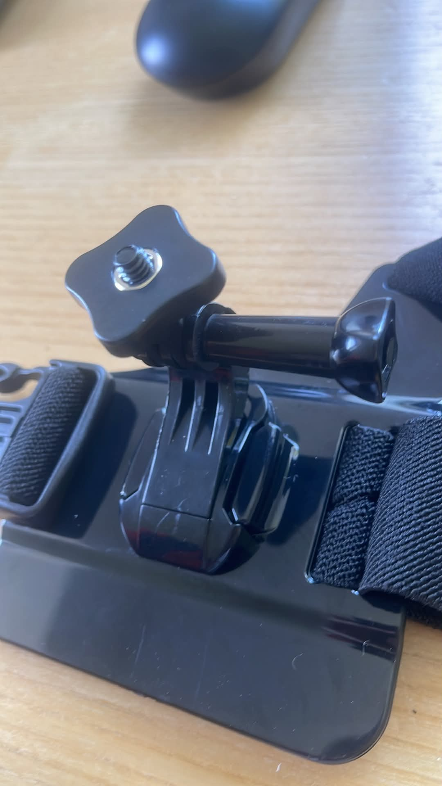

*Figure 2 — Photograph of the camera mount of the chest harness.* <!-- src:F2.1.B -->

#### Auscultation points as design basis

<!-- src:P2.1.4 -->
The four modules are placed at the standard clinical auscultation positions. These positions are not arbitrary: they are chosen because the sound from each valve transmits most strongly there, since that valve projects most closely onto the chest wall at that point. The table below links each module to its anatomical location and clinical context.

<!-- src:T2.1 -->

| Module | Valve | Anatomical position | Clinical context |
|---|---|---|---|
| Module 1 | Aortic | 2nd intercostal space, right of the sternum | Aortic stenosis, aortic regurgitation |
| Module 2 | Pulmonary | 2nd intercostal space, left of the sternum | Pulmonary sounds |
| Module 3 | Tricuspid | 4th intercostal space, left of the sternum | Right-sided valvular disorders |
| Module 4 | Mitral (apex) | 5th intercostal space, mid-clavicular line | Mitral stenosis, mitral regurgitation, S3/S4 |

> *[Photograph still to be added — the Essentiel-B chest harness worn by a test subject, with the four auscultation points (aortic, pulmonary, tricuspid, apex/mitral) marked visually.]* <!-- src:F2.1.C -->

### 2.2 Output strategy — haptics and sound

#### Operating principle of a stethoscope and the sound–vibration relationship

<!-- src:P2.2.1 -->
Before the choice for a hybrid output (motors *and* speakers) can be justified, it is important first to consider how a stethoscope physically works. This is essential to understanding the concept, because sound and vibration are interdependent.

<!-- src:P2.2.2 -->
Sound *consists of* vibrations. What is perceived as sound is always a mechanical wave transmitted through a medium — usually air. The heart, which during every cycle slams valve leaflets shut and pumps blood under pressure, continuously produces small vibrations. Both a normal heartbeat and pathological phenomena (valve failure, leakage, narrowing) each generate their own vibration and sound signature.

<!-- src:P2.2.3 -->
These vibrations are conducted further through the body tissue and ultimately cause the skin surface to vibrate along. The amplitude, however, is small. The main component of the heartbeat — the physical "pump" — is, with some training, palpable on the chest and even at the wrist, neck, and other superficial arteries. The finer vibrations associated with pathology (a murmur caused by turbulent flow, an S3 gallop in heart failure) are, however, too weak to detect with fingers.

<!-- src:P2.2.4 -->
This is where the stethoscope comes in. The instrument consists of a thin film or membrane placed against the skin. The tiny surface vibrations of the skin drive this membrane. The acoustic bell and the tubes then act as a directional amplifier: the movements of the membrane are converted into air-pressure displacements that are guided to the listener's ears. In this way a mechanical vibration of the skin surface — inaudible to the naked ear — is transduced and amplified into a clearly perceptible sound. It is a simple but mechanically very thoughtful instrument: relatively cheap, broadly available, and therefore the most used diagnostic tool in primary care [10].

#### Core of the concept

<!-- src:P2.2.5 -->
A stethoscope is, in essence, a mechanical-acoustic vibration-to-sound converter. There is therefore no need to generate sound *in the air*: only the skin surface, at the right location, must be made to vibrate in the right way. The stethoscope does the rest of the work and converts those vibrations into an audible signal.

<!-- src:P2.2.6 -->
From this principle the output design follows logically. The body surface must be made to vibrate in the right way at the right location — not necessarily air-borne sound must be produced. This can be done in two complementary ways:

<!-- src:L2.2.1 -->
- **Haptic motors as the primary vibration source:** these press directly against the skin and make the skin surface literally vibrate, just as the heart itself would — only artificially driven. When the stethoscope is placed on that skin, the membrane picks up exactly those vibrations and converts them to sound. The system is therefore first and foremost a *haptic skin*: a skin surface that is converted back into sound by a measuring instrument — the stethoscope. The core of the genesis mechanism of the heart sound itself is thus used as the basis of the design.
- **Speakers as acoustic complement:** in parallel with each motor set, a small speaker is added. It produces air vibrations that do not directly reach the stethoscope (the stethoscope seals against the skin), but they do make the skin between module and stethoscope vibrate along. The speaker thus effectively becomes a second haptic element: its air-borne vibrations are converted into skin vibrations which the stethoscope picks up.

<!-- src:P2.2.7 -->
By combining both modalities a wider spectrum is covered than is possible with sound or vibration alone. Low frequencies (S3, S4, the diastolic rumble of mitral stenosis) are physically best transmitted as vibration — the motors provide the strongest signal there. Higher frequencies (sharp harmonics in aortic stenosis, high-frequency murmurs) are harder to generate mechanically with a coin motor and are better reproduced by the speaker. Moreover, the combination enables an experimental search for the best clinical realism: for some pathologies the motor is dominant, for others the speaker, and for most a weighted combination.

#### Module definition

<!-- src:P2.2.8 -->
*One module = 1 speaker + 3 vibration motors, together on one 3D-printed base. Four identical modules distributed across the auscultation points together form the output layer of the system.*

#### 2.2.1 Vibration motors — mini coin haptic motors

<!-- src:P2.2.1.1 -->
For the haptic output, flat mini coin vibration motors with a nominal voltage of 3 V and dimensions Ø 10 × 2.7 mm have been chosen (50-piece kit from Amazon, used to test mounting and assembly). Their flat shape provides direct skin contact without intermediate elements that would dampen the vibration. Because a single coin motor is relatively small, three of these motors are used per module in parallel: this enlarges the contact area, guarantees a sufficiently strong signal even if one motor makes less than optimal contact, and provides redundancy. The motors are strong enough and could handle a much larger amplitude, but operating at a smaller percentage of their possible capacity means that the mechanical noise of the motors themselves stays lower — making the simulation more realistically perceivable.

<!-- src:P2.2.1.2 -->
Compared with the wider LRA/ERM motors used in the lab, these coin motors are easier to mount on a flat 3D print and keep the modules thin, which is important for wearing comfort under the harness. They also have a faster start-stop response than larger ERM motors, which permits sharply placing briefly triggered pulses (such as the 60 ms S1 and S2 pulses) within the cardiac cycle.

##### Electrical characterisation of a single coin motor

<!-- src:P2.2.1.3 -->
A coin motor is a miniaturised DC motor with an eccentric mass; rotation of the mass produces a transverse vibration force. Electrically, such a motor behaves roughly as a series connection of a winding resistance and a back-EMF source. From the datasheet, the following values apply to the 10 × 2.7 mm motor:

<!-- src:T2.2.1 -->

| Parameter | Symbol | Value | Explanation |
|---|---|---|---|
| Nominal voltage | Uₙ | 3.0 V DC | Operating point at which the specified vibration is delivered |
| Permissible voltage range | U | 2.5 – 3.7 V | Below 2.5 V the motor may not start; above 3.7 V life is strongly reduced |
| Rated current at Uₙ | Iₙ | ≈ 70 mA | Continuous, in steady state after start-up |
| Peak current (in-rush) | Iₛₜₐᵣₜ | ≈ 100 mA | During ~50 ms at start-up (still → rotating) |
| Power | Pₙ | ≈ 0.21 W | Pₙ = Uₙ · Iₙ = 3 V · 0.07 A |
| Vibration frequency | f | ≈ 200 Hz | At Uₙ; varies with voltage |
| Vibration amplitude | G | ≈ 0.8 G | Acceleration at the housing; indicative value |

##### Three motors in parallel — current and power balance per module

<!-- src:P2.2.1.4 -->
Within one module, three motors are connected in parallel on a single output driver. Because they are electrically identical and work at the same voltage, the current from the driver is the sum of the three individual currents, while the voltage across each motor remains equal.

$$I_\text{module} = 3 \cdot I_\text{motor} = 3 \cdot 70~\text{mA} = 210~\text{mA} \quad \text{(steady state)}$$

$$I_\text{module, peak} = 3 \cdot 100~\text{mA} = 300~\text{mA} \quad \text{(in-rush, ~50 ms)}$$

$$P_\text{module} = U \cdot I_\text{module} = 3~\text{V} \cdot 0.21~\text{A} = 0.63~\text{W}$$

<!-- src:P2.2.1.5 -->
This 300 mA peak current per module is deliberately the dimensioning factor for the choice of driver. The DRV2605L may continuously deliver 250 mA, so the 300 mA in-rush sits against the absolute top limit. In practice this works well because

1. the peak is very short;
2. the driver has built-in current limiting [24];
3. the pulses typically last 60–100 ms — short enough to pose no thermal problem.

##### Why this is the best option for us

<!-- src:L2.2.1.2 -->
- Compact and thin (Ø 10 × 2.7 mm) — fits within the wearing comfort under the harness.
- Low operating voltage (3 V) — interfaces seamlessly with the 3.3 V rail of the Arduino Nano ESP32 and the DRV2605L driver.
- Modest current draw (≤ 100 mA per motor) — three in parallel remain below the 300 mA limit of the driver.
- Fast attack/decay — suitable for short heart-sound signals (60 ms pulses) that must sit sharply within the cycle.
- Cheap and available in bulk (50 pieces ≈ €16) — allows experimentation and defect replacement without budget pressure.

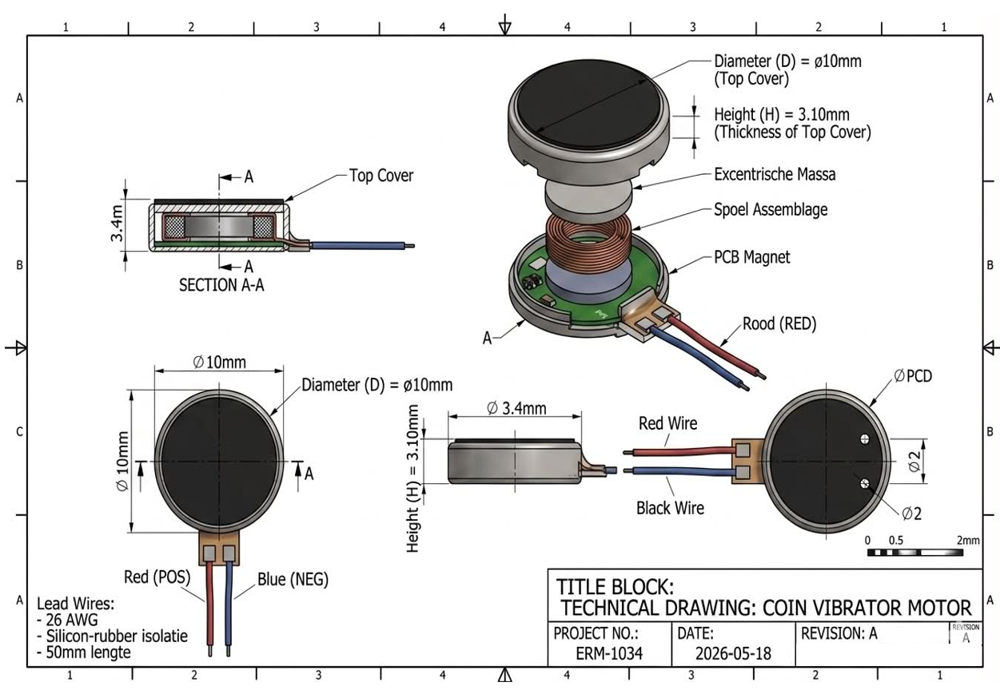

*Figure 3 — Mini coin haptic motor (3 V, 10 × 2.7 mm) as used in every module; three of these motors are wired in parallel per module on one DRV2605L driver.* <!-- src:F2.2.1 -->

#### 2.2.2 Speakers — 40 mm magnetic loudspeakers

<!-- src:P2.2.2.1 -->
For the acoustic part of every module, round magnetic loudspeakers of 40 mm diameter with a power rating of 2 W are used. They fit exactly into the 3D-printed module base by diameter and have a built-in JST-PH connector with pre-mounted cable, which simplifies wiring and reduces the chance of a short at the speaker terminals.

<!-- src:P2.2.2.2 -->
Their frequency response covers the range that is clinically relevant for heart sounds (approximately 100 Hz to a few kHz), including the typical murmur frequencies between 100 and 600 Hz [22]. The speakers are 8 Ω class, meaning that they deliver enough sound directly from a class-D amplifier with an output-stage voltage of a few volts for the application (the loudness must be audible for the stethoscope, not for the whole room).

##### Power and current calculation per speaker

<!-- src:E2.2.2.1 -->
$$P_\text{speaker} \le 2~\text{W} \quad (\text{rated})$$

$$Z_\text{speaker} = 8~\Omega$$

$$U_\text{speaker (RMS, max)} = \sqrt{P \cdot Z} = \sqrt{2 \cdot 8} = 4~\text{V}_\text{RMS}$$

$$I_\text{speaker (RMS, max)} = U / Z = 4 / 8 = 0.5~\text{A}_\text{RMS}$$

<!-- src:P2.2.2.3 -->
In practice the speakers operate well below this maximum — the heart sounds are relatively quiet, and the amplifier is set to a typical operating point of about 1 V_RMS, which corresponds to ~125 mW per speaker. The peak current during short transients (the attack of an S1 thud) can briefly rise to ~300 mA, but this falls within the specification of the MAX98357 amplifier [25].

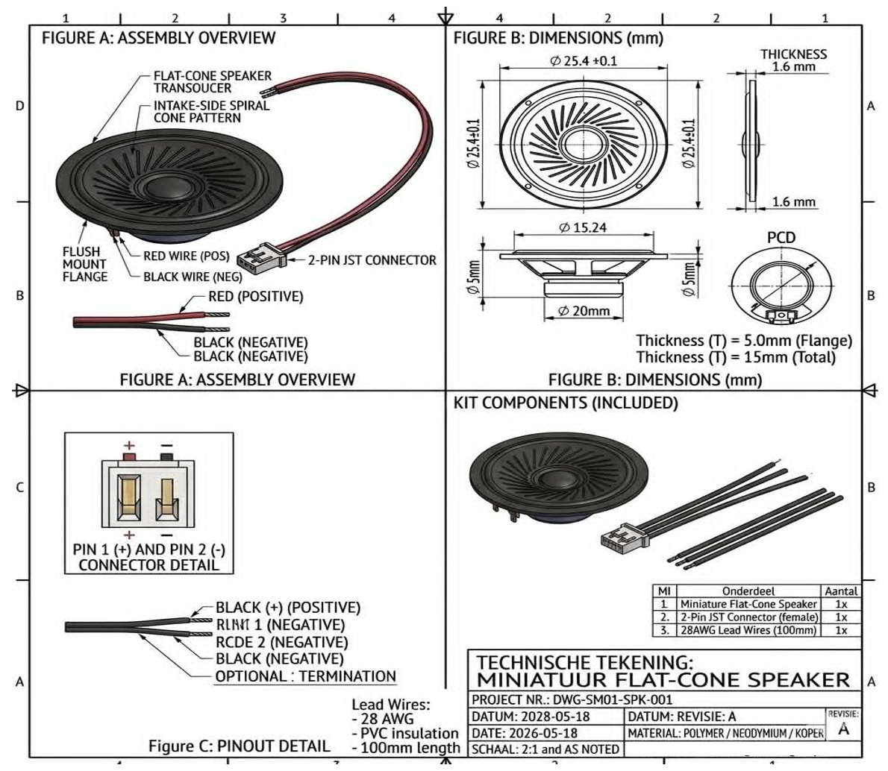

*Figure 4 — 40 mm / 8 Ω / 2 W magnetic loudspeaker with pre-mounted JST-PH cable, suitable for reproducing heart sounds in the 100 Hz – 5 kHz band.* <!-- src:F2.2.2 -->

#### 2.2.3 Combination into one module

<!-- src:P2.2.3.1 -->
One speaker and three motors together form one module. This logical grouping simplifies both the mechanical design (one 3D print per module) and the control in software: each module corresponds to one audio channel and one haptic channel. In addition, it allows assigning a per-module "loudness" weight in firmware — essential for simulating clinical murmur radiation (see §6).

### 2.3 Motor control

#### 2.3.1 Haptic driver DRV2605L (I²C)

<!-- src:P2.3.1.1 -->
Connecting a coin motor directly to a GPIO pin of the Arduino is technically possible but unwise for several reasons: the GPIO pin can deliver only ~20 mA (70 mA are needed), has no protection against the back-EMF spike that occurs when the motor is switched off, and offers no control over the drive curve. The industry solution is a dedicated *haptic driver* — the Texas Instruments DRV2605L is used, the same as in the lab.

##### How this driver works

<!-- src:L2.3.1.1 -->
The DRV2605L is a mini-controller for one motor. It communicates with the microcontroller via the I²C protocol (two wires: SDA and SCL, alongside power and GND) and internally contains:

- An **H-bridge output stage** that can drive the motor in two directions — necessary for LRA motors with alternating polarity, but also usable for the ERM coin motors as a unidirectional drive.
- A **built-in library of 123 pre-defined haptic patterns** (knock, double knock, heartbeat-like wave, ramp-up, and so on) that can be played directly via a register trigger — useful to quickly try different characters for S1, S2, and gallop events [24].
- A **real-time playback mode** in which custom amplitude values (8-bit, 0–255) are streamed directly — indispensable for triggering the motor exactly in sync with the detected heartbeat.
- An **auto-resonance detection** for LRA motors (not relevant with coin motors).
- **Current protection** with a continuous limit of 250 mA and short-circuit protection; on overcurrent the output stage is shut down.

##### Electrical specifications relevant for our design

<!-- src:T2.3.1 -->

| Parameter | Value | Relevance for our design |
|---|---|---|
| Supply voltage V_DD | 3.0 – 5.5 V | We power with 3.3 V from the MB102 rail (same rail as motor) |
| I²C voltage V_IO | 1.8 – 3.6 V | Compatible with 3.3 V logic of the ESP32 |
| Standard I²C address | 0x5A | Same for all DRV2605L → reason for multiplexer (§2.3.2) |
| Continuous output current | 250 mA | Just feasible for three motors in parallel (210 mA steady, 300 mA peak) |
| Output voltage OUT+/OUT− | 0 – V_DD | Differential; effective 3 V across the motor at V_DD = 3.3 V |
| Effects library (ROM) | 123 effects | Fast prototyping without an own waveform engine |
| Trigger-to-output latency | < 1 ms | Low enough to trigger S1 within the 50 ms budget |

##### How the three motors are wired to it

<!-- src:P2.3.1.2 -->
One DRV2605L drives one module. The three coin motors within that module are mounted in parallel on the OUT+ / OUT− pads. Because all motors are identical, each contributes equally to the current: the driver effectively sees one virtual motor with an equivalent resistance that is three times lower.

<!-- src:E2.3.1.1 -->
$$R_\text{motor} \approx U_n / I_n = 3~\text{V} / 0.07~\text{A} \approx 43~\Omega$$

$$R_\text{module} = R_\text{motor} / 3 \approx 14~\Omega \quad \text{(three motors in parallel)}$$

$$I_\text{module (steady)} = U_\text{DD} / R_\text{module} = 3~\text{V} / 14~\Omega \approx 210~\text{mA}$$

<!-- src:P2.3.1.3 -->
This 210 mA stays below the 250 mA limit of the driver, with margin for the ~50 ms in-rush at start-up. Moreover, within a cardiac cycle, typically only one or two modules are active at the same time (an S1 or S2 pulse, ~60 ms), so the drivers remain well within their thermal budget.

##### Why the DRV2605L is the best option for us

<!-- src:L2.3.1.2 -->
- One chip provides everything a generic MOSFET schematic with flyback diode + RC snubber + amplitude DAC would require — fewer components on the breadboard, fewer chances of miswiring.
- I²C control fits into the existing bus architecture — I²C is already needed for the multiplexer.
- Effects ROM permits feel-prototyping without generating waveforms; real-time mode gives full control once we are ready.
- 250 mA output current matches exactly the parallel arrangement of three coin motors.
- Identical to the driver from the lab — known behaviour, existing Adafruit library available.

> *Figure 5 — Adafruit breakout board with the Texas Instruments DRV2605L haptic driver. The pinout includes VIN, GND, SDA, SCL, EN, IN/TRIG, OUT+, and OUT−. One driver controls three motors connected in parallel. (No image embedded in the source — caption preserved for completeness.)* <!-- src:F2.3.1 -->

#### 2.3.2 I²C multiplexer TCA9548A

<!-- src:P2.3.2.1 -->
The design needs four DRV2605L drivers — one per module. But all DRV2605L chips share the same standard I²C address (0x5A), which cannot be changed by pin strapping. Four identical addresses on the same bus is a fundamental conflict: as soon as the Arduino sends a command to address 0x5A, all four drivers would respond at once, with unpredictable bus collisions as a result.

##### Working principle of the TCA9548A

<!-- src:P2.3.2.2 -->
The Texas Instruments TCA9548A is a 1-to-8 I²C bus switch: it has one upstream bus (microcontroller side) and eight downstream buses (SD0/SC0 to SD7/SC7). Via an own I²C register, the Arduino can select which of the eight downstream buses is currently switched through. Only the selected channel bus receives the I²C signals; the other seven are electrically decoupled.

<!-- src:P2.3.2.3 -->
In this way four identical DRV2605Ls can each be connected to their own downstream channel (channel 0–3). The Arduino selects the channel of the module it wants to address, sends the I²C command, and switches to another channel for the next module. For the software every driver looks identical (all at 0x5A) — the difference lies entirely in which channel is currently active.

##### Current and voltage budget

<!-- src:T2.3.2 -->

| Parameter | Value | Explanation |
|---|---|---|
| Supply voltage V_CC | 1.65 – 5.5 V | 3.3 V from the MB102 rail |
| Own current draw | ~1 µA (stand-by) / 100 µA (active) | Negligible in the current balance |
| Pass-through resistance per channel | ~4 Ω (typical) | Causes no measurable voltage drop on I²C signals |
| Address of TCA9548A itself | 0x70 (default, configurable) | Pin A0/A1/A2 to GND → address 0x70 |
| Number of channels | 8 | We use 4; room for expansion |
| Maximum I²C speed | 400 kHz (Fast-mode) | Sufficient for our update rate < 100 Hz |

<!-- src:P2.3.2.4 -->
The TCA9548A is effectively a passive component in the current balance — it draws almost no current itself and introduces no meaningful voltage loss. Its only overhead is an additional I²C write to select the channel (a 2-byte command, at 400 kHz thus ~50 µs). In software this behaviour is wrapped in a single `selectMuxChannel(n)` function that is called before every driver action.

<!-- src:P2.3.2.5 -->
At every I²C call to a DRV2605L, `selectMuxChannel(n)` is invoked first, after which the correct driver is reached. This wrapper sits centrally in the `HapticManager` class so that the rest of the firmware need not be aware of the multiplexer.

##### Why the TCA9548A is the best option for us

<!-- src:L2.3.2.1 -->
- One chip resolves the identical-address problem without hardware modifications to the drivers.
- Eight channels — four needed now, four spare for future extensions (e.g. extra sensor or LCD).
- Negligible current draw and voltage loss.
- Already seen during the lab, familiar operation, and known Adafruit library available.

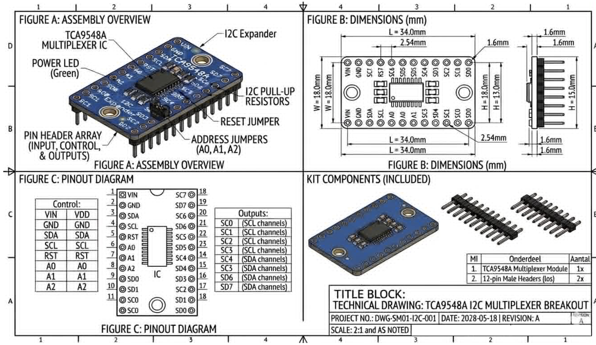

*Figure 6 — Schematic operation and pinout of the TCA9548A I²C multiplexer: one upstream bus (SD/SC) is switched through to one of eight downstream buses (SD0–SD7 / SC0–SC7).* <!-- src:F2.3.2 -->

### 2.4 Speaker control — choice of a new Arduino

<!-- src:P2.4.1 -->
Controlling the speakers is technically harder than controlling the motors. Audio signals require a continuous data stream — even a simple heart-sound fragment of one second already contains 44 000 bytes at 22 kHz sample rate and 16-bit resolution. That data regime must flow through the microcontroller without interruption, otherwise audio clicks and buffer underruns become audible. The originally planned Arduino Micro cannot deliver this: its general I/O pins were not designed for the continuous PCM signal that a digital audio channel requires, and its 16 MHz ATmega32U4 core has too little RAM and no DMA to stream audio in the background.

#### Rejected alternative — DFPlayer-Mini-style SD-card audio

<!-- src:P2.4.2 -->
One option considered was a separate audio module (e.g. DFPlayer Mini) that plays WAV files from a microSD, triggered via UART or a GPIO by the Arduino. This separates audio and control clearly and saves processor time on the Arduino. But it also introduces latency — typically 100–200 ms between sending a trigger and the audible result — and it limits the control over real-time modulation (volume between pulses, exact alignment with the R-peak, pitch shifts). For a realistic simulation that must synchronise tightly to the R-peak this is not an ideal solution.

#### Chosen solution — Arduino Nano ESP32 with I²S output

<!-- src:P2.4.3 -->
For audio, the I²S protocol (Inter-IC Sound) is the better choice: it is a digital serial bus, originally designed by Philips, made exactly for PCM audio. I²S uses three wires — Bit Clock (BCLK), Word Select / Left-Right Clock (LRCLK), and Data In (DIN) — and can communicate with memory via DMA without the processor having to copy samples continuously.

<!-- src:P2.4.4 -->
The Arduino Micro has therefore been replaced by an Arduino Nano ESP32, a board built around the Espressif ESP32-S3 chip. The evolution to this board was driven by an accumulation of requirements: audio (I²S) was needed; parallel tasks (PPG sensing + audio streaming + cycle planning) were needed. The Nano ESP32 ticks all of those boxes on a single 18 × 45 mm board [26].

##### Key properties that justify this choice

<!-- src:L2.4.1 -->
- **Dual-core processor (ESP32-S3):** two Xtensa LX7 cores at 240 MHz. Core 0 is assigned to PPG sampling and cycle planning; core 1 to the I²S audio task. This means audio can never stutter when sensor processing momentarily needs more CPU — two independent traffic streams on two separate motorways.
- **Much more RAM (520 KB internal SRAM + 8 MB PSRAM):** the Arduino Micro had 2.5 KB RAM, which cannot even fit one second of audio (~44 KB). The ESP32-S3 can effortlessly hold multiple seconds of audio buffers, the PPG ring buffer, the pulse queue for the haptics, and all FreeRTOS stacks.
- **Faster clock (240 MHz vs 16 MHz):** a factor 15 faster. The DSP code — biquad filter, peak detection, FFT loop for signal visualisation — requires tens of thousands of floating-point operations per second in real time. On a 16 MHz AVR this would never fit within the ~4 ms time budget per sample.
- **Two physical I²S ports:** audio channel routing to multiple amplifiers becomes a software matter rather than a hardware problem. One I²S port is now used for the two MAX98357 amplifiers (see §2.4.1), but the second I²S channel remains available for future expansion (e.g. per-module amplifier).
- **Built-in Wi-Fi and Bluetooth/BLE:** opens the possibility of operating the system via a web interface that runs directly on the Arduino, as an access point, without dependence on a separate PC. A phone or laptop thus becomes a remote control and the test subject can walk around fully wirelessly after setting up the harness (excluding the power supply; a battery would be possible).
- **Native USB-CDC:** serial debugging without an external USB-UART chip, and simple firmware upload via USB. Important during iterative development where flashing happens often.

##### Current and voltage specifications of the Arduino Nano ESP32

<!-- src:T2.4.1 -->

| Parameter | Value | Relevance / explanation |
|---|---|---|
| Supply voltage via VIN | 5 V (4.5 – 21 V permissible) | We power via the 5 V rail of the MB102 |
| Supply voltage via 3V3 pin | 3.3 V | Regulated by the board LDO, used for I²C peripherals |
| Current draw (typical) | ~60 – 80 mA | At average load with Wi-Fi active |
| Current draw (peak, Wi-Fi TX) | up to ~240 mA | Short bursts during wireless communication |
| Maximum current per GPIO | 20 mA (continuous, recommended) | Sufficient for logic, too little for motors |
| Maximum current 3V3 pin out | ~600 mA | Not used as an external supply — everything runs via MB102 |
| ADC resolution | 12-bit (0–4095) | More than sufficient for the PPG sensor with dynamic threshold |
| I²S ports | 2 (full DMA) | Sufficient for audio output without CPU load |
| RAM internal / PSRAM | 520 KB / 8 MB | Audio buffers, web HMI, PPG ring buffer fit comfortably |
| Flash | 16 MB (firmware + LittleFS) | Firmware ~1 MB, rest for the `data/` partition with HMI files |

##### Limits and what they mean for our circuit

<!-- src:P2.4.5 -->
It is important to distinguish sharply between what the Arduino can handle on its signal pins and what the board LDO can deliver as power supply. The GPIO pins deliver only ~20 mA per pin and are therefore designed for logic, not for directly driving actuators. A coin motor would already pull 70 mA and would push a GPIO straight into over-current protection — or, if that does not work, damage the pin irreversibly.

<!-- src:P2.4.6 -->
This is precisely why the Arduino is positioned as *signal intelligence* and not as *energy supplier*: the Arduino sends commands via I²C and I²S, and specialised drivers (DRV2605L, MAX98357) do the heavy work. The Arduino can thus remain within its comfortable operating point (~80 mA total), even when the actuators together quickly pull a few hundred mA.

<!-- src:P2.4.7 -->
The choice of the Nano ESP32 thus follows from a long chain of technical constraints: more memory was needed than an AVR board can offer; faster processing than a 16 MHz clock; an I²S port; a radio for wireless control; and a dual core to keep audio separate from sensing. Each individual argument could be circumvented by a cheaper board; together they all point to the same solution.

##### How we arrived at this choice

<!-- src:P2.4.8 -->
We started from the design with the Arduino Micro for the motors and ran into the audio extension along the way. The question became: can PCM audio be streamed alongside motor control, while a PPG signal is sampled at 250 Hz and cardiac-cycle events are scheduled in parallel? On an AVR with 2 KB RAM and no I²S the answer was no.

<!-- src:P2.4.9 -->
An intermediate solution with an SD-card audio module was rejected because of latency and lack of real-time control. The step to ESP32-S3 resolves all three bottlenecks in one go: I²S in hardware, dual cores for parallelism, and sufficient memory for audio buffers + web interface.

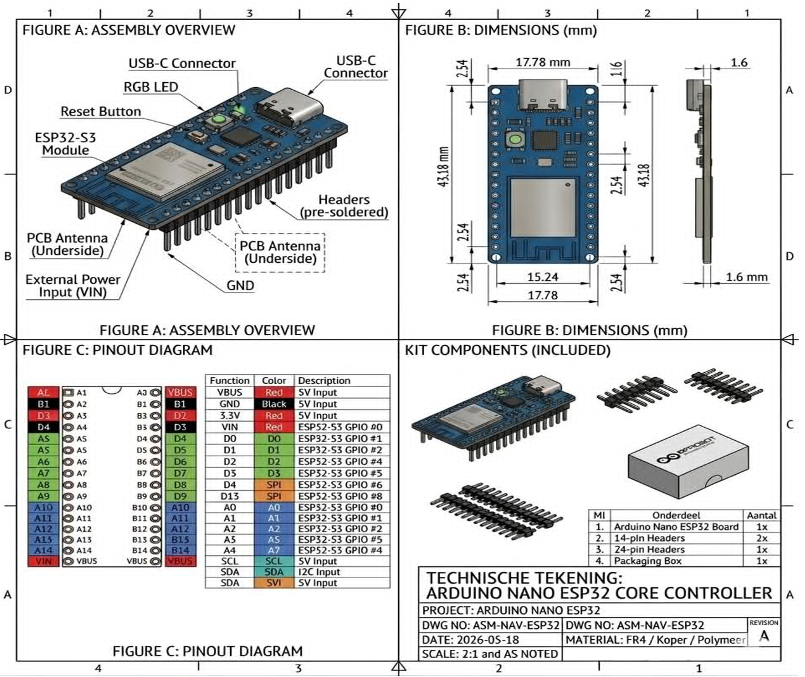

*Figure 7 — Arduino Nano ESP32. For our system the following pins are relevant: VIN/GND (5 V supply), 3V3 (reference), A0 (analogue input for the PPG sensor), D2/D3 (I²C: SDA/SCL), and the three I²S pins for the audio amplifier.* <!-- src:F2.4 -->

#### 2.4.1 I²S amplifier MAX98357

<!-- src:P2.4.1.1 -->
An I²S signal is a digital data stream, not an audio signal that can drive a speaker. Between the Arduino and the speaker, therefore, a circuit must sit that

1. converts the I²S signal into an analogue audio signal (DAC function);
2. amplifies this signal sufficiently to make the speaker sound (power amplification).

Both functions together are called an "I²S amplifier".

<!-- src:P2.4.1.2 -->
A custom output stage with an external DAC, an operational amplifier, and a class-AB or class-D output stage with MOSFETs could have been designed, but a ready-made module gives a more reliable and compact result. For this reason, the Maxim MAX98357 was chosen — a class-D audio output stage with an integrated I²S DAC, mounted on a breakout board (Adafruit-compatible) [25].

##### Working principle and electrical characterisation

<!-- src:P2.4.1.3 -->
The MAX98357 receives an I²S stream (3 wires: BCLK, LRCLK, DIN) and delivers a class-D output directly at its OUT+ / OUT− terminals. Class-D means that the output stage does not deliver the desired voltage linearly (as a class-AB does) but works as a fast PWM switch at ~330 kHz, followed by a built-in output filter. That gives a high efficiency (>90 %) and very little heat dissipation, both critical with a battery or breadboard supply.

<!-- src:T2.4.1.1 -->

| Parameter | Value | Explanation / meaning for our design |
|---|---|---|
| Supply voltage V_DD | 2.5 – 5.5 V | We power with 5 V from the MB102 rail |
| I²S logic level | 1.8 – 3.6 V | Compatible with 3.3 V pins of the ESP32 |
| Max output power (4 Ω @ 5 V) | 3.2 W | Our speaker is 8 Ω: max ~1.8 W |
| Max output power (8 Ω @ 5 V) | ~1.8 W | Well above our actual working load of ~125 mW |
| Output current (peak) | up to 1.4 A | Plenty of margin compared with our speaker peak of ~300 mA |
| Efficiency (class-D, full power) | ~90 % | Little heat loss — no heatsink needed |
| Gain (adjustable via GAIN pin) | 3, 6, 9, 12, 15 dB | Default 9 dB; adjustable by pulling the pin high or low |
| SHDN/MODE pin | Logic | Switches amplifier OFF (audio shorted) or plays through |
| Idle consumption | ~2 mA | Negligible when no audio is playing |

##### How we wire it in our set-up

<!-- src:P2.4.1.4 -->
In the ideal case, every speaker would have its own MAX98357 amplifier — four in total — so that an independent audio channel per module would be possible. To keep budget and complexity within limits, two amplifiers have been purchased: each amplifier drives two speakers simultaneously, meaning that two modules share one audio channel. The I²S connection offers mono or stereo: in stereo mode the left-channel and right-channel data can be split via two MAX98357s, so that effectively two independent channels are obtained (one per amplifier, thus one per two modules).

<!-- src:P2.4.1.5 -->
Per-module volume modulation remains possible via the SD/GAIN pin of the MAX98357. By driving this pin with a PWM signal from the Arduino (filtered by a simple RC low-pass to obtain DC), the gain can be varied gradually. This allows clinically relevant intensity differences between auscultation points to be simulated — for example, an aortic stenosis murmur that is loudest at the aortic point and softer at the apex.

##### Current and power balance per amplifier

<!-- src:E2.4.1.1 -->
$$P_\text{out (max, 8~\Omega)} \approx 1.8~\text{W}$$

$$U_\text{speaker (max RMS)} = \sqrt{P \cdot Z} = \sqrt{1.8 \cdot 8} \approx 3.8~\text{V}_\text{RMS}$$

$$I_\text{amp, peak (two speakers parallel/series)} \approx 0.5 – 0.7~\text{A}$$

$$I_\text{amp, average at our operating point (~125 mW per speaker)} \approx 50 – 80~\text{mA}$$

<!-- src:P2.4.1.6 -->
The MAX98357 specifies a peak current of 1.4 A at full power — we operate well under that limit. However, this does mean that during a short transient (e.g. an S1 thud with high amplitude) the amplifier can briefly draw 300–400 mA; this is the reason why the 5 V rail of the MB102 needs sufficient capacity (see §2.7).

##### Why the MAX98357 is the best option for us

<!-- src:L2.4.1.1 -->
- One chip combines DAC + amplifier — fewer components, fewer chances of miswiring.
- Class-D with > 90 % efficiency — no heat problems on the breadboard.
- I²S input directly from the Arduino, no analogue intermediate stage with noise.
- SD/GAIN pin makes volume modulation possible without hardware modification.
- Adafruit-compatible breakout with all necessary decoupling capacitors built in.

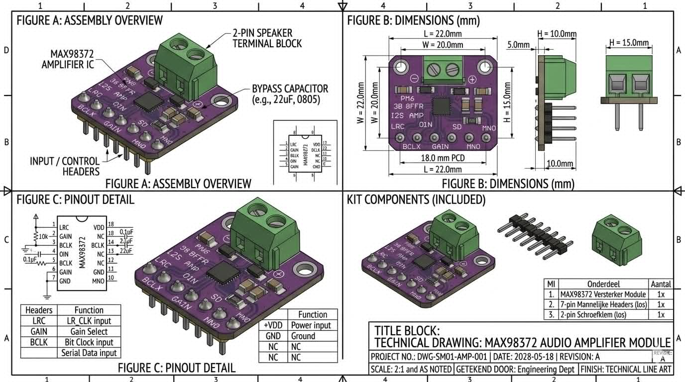

*Figure 8 — MAX98357 I²S class-D audio amplifier (breakout board). The three I²S pins (BCLK, LRC, DIN) connect to the Arduino; OUT+ and OUT− go directly to the speaker without additional filtering.* <!-- src:F2.4.1 -->

### 2.5 Heart-rate sensor — DFRobot SEN0203 (PPG)

<!-- src:P2.5.1 -->
For real-time heart-rate measurement, a photoplethysmography sensor (PPG) was chosen: the DFRobot SEN0203 Heart Rate Monitor. A commercial sports wristwatch monitor gave too little control over the raw signal and the sample rate — most of these devices deliver only an already-processed BPM value over Bluetooth, with latency of a few hundred milliseconds and no access to the underlying waveform.

#### Working principle of PPG

<!-- src:P2.5.2 -->
PPG (photoplethysmography) measures the variation in light absorption of blood at every pulse. The sensor shines a red — or in this case green — LED through (or onto) the skin, and a nearby photodiode measures how much light is reflected back or transmitted through the tissue. With every heartbeat the volume of the blood vessels under the sensor changes slightly — more blood means more absorption, hence less measured light. The resulting signal is a lightly oscillating analogue voltage that follows the heart-rate waveform.

<!-- src:P2.5.3 -->
The SEN0203 is a DFRobot breakout with an integrated LED, photodiode, and analogue front-end (amplifier + filter). The output is a raw analogue signal between approximately 1.2 and 2.8 V that is fed directly into the ESP32's ADC.

##### Electrical characterisation

<!-- src:T2.5.1 -->

| Parameter | Value | Explanation |
|---|---|---|
| Supply voltage V_CC | 3.3 – 5 V | We power with 3.3 V from the MB102 rail |
| Current draw | ~4 – 5 mA | Mainly the LED |
| Output | Analogue (DC + AC) | DC baseline ~2 V; AC component ~±50–200 mV at pulsing |
| Output range | 0 – V_CC | Fits within the 12-bit ADC range of the ESP32 |
| Recommended sample rate | ≥ 100 Hz | We sample at 250 Hz for extra margin |
| Latency of the sensor itself | < 10 ms | Negligible compared with our 50 ms budget |

##### How we process the signal (overview; details in §5.3 and §6)

<!-- src:P2.5.4 -->
The raw ADC reading is a slow, drift-sensitive DC baseline with a small AC component on top. To extract the heart rate, a processing chain is applied:

<!-- src:L2.5.1 -->
- **Sampling at 250 Hz** via a fixed-rate scheduler in the main loop (drift-free with `millis()`-based timing).
- **High-pass filter (~0.5 Hz)** to remove the DC baseline. This leaves only the oscillation around zero.
- **Low-pass filter (~5 Hz)** to attenuate high-frequency noise (50/60 Hz mains hum, motion). Together they form a 0.5–5 Hz bandpass — the physiologically relevant band for heart rates between 30 and 300 BPM.
- **Adaptive peak detection** with a dynamic threshold that adapts to the signal amplitude — robust to varying finger pressures, skin tones, and sensor positions (see §6.8.3 for the algorithm explanation).
- **Inter-beat interval (IBI) calculation** from successive peaks, and an average BPM via a rolling median over 5 IBIs for noise robustness.

<!-- src:P2.5.5 -->
This low-level control is essential because the timing of the simulation — when S1 and S2 are played, where a murmur falls in the cardiac cycle — is entirely based on R-peak detection and the calculated IBI. The latency from detection to output must remain within ~50 ms; only a direct sensor with an own processing chain achieves that budget.

##### Why the SEN0203 is the best option for us

<!-- src:L2.5.2 -->
- Delivers a raw analogue signal — full control over filtering and peak detection.
- Works on 3.3 V, compatible with the ESP32 ADC without a voltage divider.
- Compact finger-clip form factor fits comfortably next to the test subject.
- Cheap (~€17) — easily replaceable on failure.
- Documentation and example code available, which speeds up bring-up.

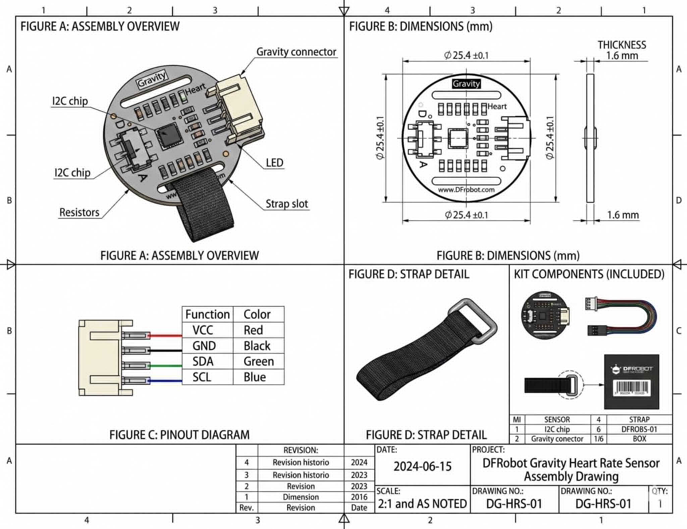

*Figure 9 — DFRobot SEN0203 PPG sensor with finger clip. The connection consists of three wires: VCC (3.3 V), GND, and the analogue signal A0 that goes to the ADC of the Arduino.* <!-- src:F2.5 -->

### 2.6 Breadboards

<!-- src:P2.6.1 -->
To allow circuits to be modified quickly during bring-up, breadboards are used rather than permanently soldered PCBs. A breadboard makes it possible to move a component or change a connection in seconds — indispensable when a building block can only be tested after it has been connected.

<!-- src:P2.6.2 -->
On the basis of a rough estimate of the number of required connections (Arduino, multiplexer, four drivers, two amplifiers, power-supply module, sensor, and four module cables) plus a margin, one large breadboard (16.4 × 5.5 cm) was chosen as the central rail, supplemented with three smaller breadboards (8 × 5.5 cm) for grouping per subsystem (audio, haptics, sensor). This layout has three practical advantages: faults are easily traceable (all haptic wiring on one board), adjustments to a subsystem do not affect the others, and the modules are physically rearrangeable within the control-module housing.

### 2.7 Power supply — MB102 power supply module

<!-- src:P2.7.1 -->
The design must deliver power to a multitude of components with different voltage classes and peak currents. A rigorous current balance is therefore not a side issue but a design prerequisite: if too much is accidentally drawn from the Arduino, the board LDO can overheat, the USB connection can go into current protection, or — in the worst case — the Arduino can be irreversibly damaged. The reasoning is therefore built up explicitly.

#### 2.7.1 Calculation of total current consumption per subsystem

<!-- src:P2.7.2 -->
Below is a conservative estimate of the maximum current consumption per subsystem on the relevant supply rails. "Steady state" is the continuous load in normal operation; "peak" is the brief load during a transient (motor start-up, audio attack). For sizing the supply, the worst realistic case is considered — not all modules fully open at once, but rather a few simultaneously firing a pulse.

<!-- src:T2.7.1 -->

| Subsystem | Rail | Steady state | Peak | Note |
|---|---|---|---|---|
| Arduino Nano ESP32 | 5 V | 60–80 mA | 240 mA | Peak during Wi-Fi TX bursts |
| TCA9548A multiplexer | 3.3 V | < 0.1 mA | < 0.1 mA | Negligible |
| 4 × DRV2605L (own consumption) | 3.3 V | 8 mA | 12 mA | Logic without motor load |
| 4 × DRV2605L → 12 motors (3/module) | 3.3 V | 210 mA per active module | 300 mA per active module | 1–2 modules active at a time |
| 2 × MAX98357 | 5 V | 4 mA | — | Stand-by, no audio |
| 2 × MAX98357 (playing, 2 speakers/amp) | 5 V | 100–160 mA | 600–800 mA | Short transients (S1/S2 attack) |
| PPG sensor SEN0203 | 3.3 V | 5 mA | 5 mA | Constant LED load |

##### Worst-case total

<!-- src:E2.7.1 -->
$$I_\text{total, steady} \approx 80 + 0 + 8 + 2 \cdot 210 + 4 + 160 + 5 \approx 680~\text{mA}$$

$$I_\text{total, peak} \approx 240 + 0 + 12 + 2 \cdot 300 + 4 + 800 + 5 \approx 1.7~\text{A}$$

<!-- src:P2.7.3 -->
This peak value of ~1.7 A is an important number. It is far more than an Arduino board can deliver without damage. An Arduino Nano ESP32 powered only via USB can typically supply about 400–500 mA outbound on its 5 V rail; the 3.3 V LDO on the board delivers about 600 mA continuously. The peak load exceeds that comfortably, especially on the 5 V rail that powers both the amplifiers and the Arduino itself.

#### 2.7.2 What would go wrong without an external supply

<!-- src:P2.7.4 -->
Suppose the whole circuit were powered directly from the Arduino (5 V pin). Three problems would arise almost at once:

<!-- src:L2.7.1 -->
- **Overheating of the board LDO and the USB port:** the voltage regulator on the Arduino is not designed for 1+ A. With sustained overload, thermal runaway sets in: the LDO climbs above 100 °C, the voltage sags, and the entire circuit becomes unreliable. In the worst case the regulator burns out.
- **Voltage dips at transients:** even if the average current just fits within budget, in-rush peaks of motors and audio attacks cause brief voltage dips on the 5 V rail. If the voltage briefly drops below ~4.3 V, the ESP32 resets (brown-out detection) — and the simulation dies in the middle of a cardiac cycle.
- **No separation between signal and power supply:** the current surges of the motors and speakers couple back via the shared 5 V rail to the Arduino. The result is audible noise on the speakers (motors making audio pulse along) and unstable ADC readings on the PPG sensor (the baseline drifts with actuator current).

<!-- src:P2.7.5 -->
The starting point is therefore that the Arduino provides the *signal intelligence* but not the *power delivery*. The power supply must be separated from the signal supply, with sufficient current reserve to absorb the peak currents without voltage dips.

##### Why the software-side restriction ("we only drive one module at a time") is not safe enough

<!-- src:P2.7.6 -->
During development, several modules are often tested simultaneously, or a fault condition is deliberately provoked to test error handling. A software bug, a steered test, or even a short circuit in a cable can suddenly require more current than would "normally" be drawn. Hardware protection via a dedicated supply is indispensable because it also catches the consequences of future software bugs — a principle that recurs in every safe embedded-system design: hardware fail-safe over software fail-safe.

#### 2.7.3 Chosen solution — MB102 breadboard power supply

<!-- src:P2.7.7 -->
For the external supply the Joy-it MB102 breadboard power supply module was chosen. This is a low-cost module (€4.29 excl. VAT) that clicks directly into the supply rails of a standard breadboard. The module has three core properties that make it ideal for us:

<!-- src:L2.7.2 -->
- **Two independent voltage outputs — 3.3 V and 5 V — both available at the same time.** Per rail, a jumper selects which voltage is on the left or right side of the breadboard. Our left rail gets 5 V (for Arduino + speakers); the right rail gets 3.3 V (for I²C peripherals + motors via drivers).
- **A built-in on/off switch,** convenient for the demo to power the system up in one motion or shut it down on a fault.
- **Self-powered via an external DC adapter** (7–12 V via a standard barrel jack) or via a USB-A port. We use a standard 9 V / 1 A wall adapter.

<!-- src:T2.7.2 -->

| Parameter | Value | Relevance for our design |
|---|---|---|
| Input voltage | 6.5 – 12 V DC (via jack) or 5 V (USB) | We power with 9 V from a wall adapter |
| Input current | up to ~1 A continuous | Sufficient for our peak demand of ~1.7 A including input-cap buffering |
| Output voltage rail 1 | 3.3 V (selectable) | Drivers, multiplexer, PPG sensor |
| Output voltage rail 2 | 5 V (selectable) | Arduino VIN, MAX98357 amplifiers |
| Output current per rail | up to 700 mA | Enough per rail, provided the load is balanced |
| Switch | On/off on the module | One action to switch the whole system on |
| Built-in decoupling | 10 µF + 100 nF per rail | Local buffering against transients |

##### Supply architecture — clear division of tasks

<!-- src:P2.7.8 -->
*Arduino = computer (signal processing). MB102 = energy supplier (power).*

<!-- src:P2.7.9 -->
Both rails (3.3 V and 5 V) are distributed from the MB102; the Arduino also gets its supply via the MB102 (on the VIN pin) and is therefore no longer dependent on a USB cable to a PC. Once the firmware and the web-interface files have been flashed onto the Arduino, the setup runs entirely with just a power cable to the wall socket.

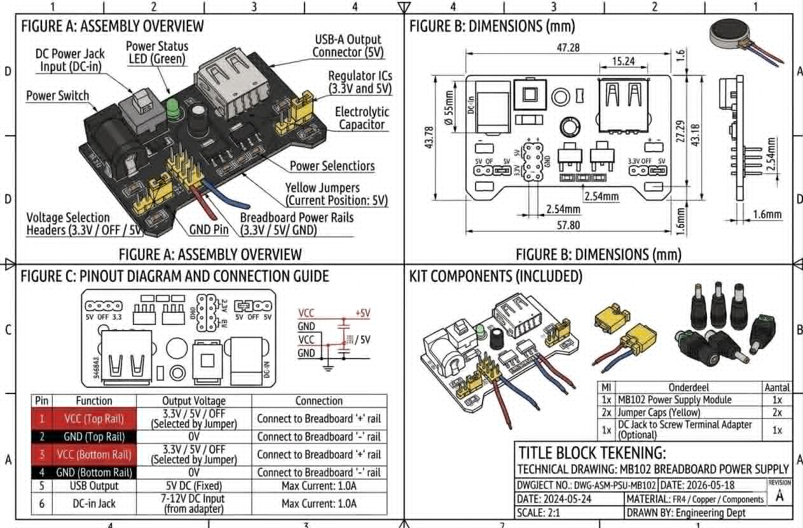

*Figure 10 — Joy-it MB102 breadboard power supply module. The module clicks directly into the supply rails of a breadboard and supplies 3.3 V and 5 V simultaneously via jumper-selectable rails. External supply via DC jack or USB-A.* <!-- src:F2.7 -->

### 2.8 Complete Integrated Circuit Schematic

Now that all individual components, their control strategies, and the power supply requirements have been defined, they are integrated into one complete, working system circuit. Figure 11 shows the fully aggregated schematic of the HeartSim prototype, combining the microcontroller, power distribution rails, I²C multiplexing, haptic drivers, audio amplification, and the PPG sensor into a single interconnected blueprint.

The system relies on a strict separation between the 5 V power rail (feeding the heavy current consumers like the audio amplifiers and the Arduino VIN) and the 3.3 V power rail (feeding the signal logic and the haptic drivers). To ensure signal integrity and prevent noise coupling, all ground (GND) lines are tied together into a single, low-impedance common ground plane.


*Figure 11 — Complete integrated circuit schematic of the HeartSim prototype.*

> **Critical Assembly Note:** Before powering on the system, verify that the jumpers on the MB102 module are explicitly set to 5 V on one side and 3.3 V on the other. Reversing these rails will deliver 5 V to the ESP32 logic pins and the DRV2605L drivers, which will cause immediate hardware failure.

---

## 3. Mechanical integration and assembly

<!-- src:P3.0 -->
With the components selected they must be combined into one wearable whole. To this end, three sorts of 3D prints were made at FabLab Leuven on a Prusa MK4 with black PLA filament: the four module housings, a breadboard tray for the control module, and a connector piece between this tray and the camera mount of the harness.

### Material choice and print parameters

<!-- src:P3.1 -->
PLA (polylactide) was chosen as the print material for several reasons that coincide for the specific use case. It is widely available — among other places in FabLab — has good dimensional stability at room temperature (no warping or shrinkage after several days). For a next iteration, TPU (thermoplastic polyurethane, flexible) could be considered for the module bases — this would give even more skin contact and comfort — but PLA is more than sufficient for a prototype that is repeatedly put on and taken off.

<!-- src:P3.2 -->
For the CAD-to-print pipeline, the choice was made to set the STL export tolerance as fine as possible. In the CAD programme the mesh-export tolerance was set to 0.05 mm (instead of the default 0.1 mm or coarser). This follows the explicit recommendation of FabLab Leuven, which advises generating STL files as fine as possible to avoid print artefacts on curved surfaces (such as the cylindrical speaker recesses and the circular module bases). A coarser tolerance would otherwise give visible facets and worsen the fit of the snap connections — a shape that is perfectly round in CAD would no longer fit into the intended recess after printing.

<!-- src:P3.3 -->
During the mechanical assembly of components into the prints, two adhesive methods were used — superglue and hot glue — and each has its own effects on the printed material that are important to know:

<!-- src:L3.1 -->
- **Superglue (cyanoacrylate):** bonds excellently to PLA. It is used where a strong, permanent connection is needed, such as the bonding of the two-part control module (tray + camera-mount intermediate piece). The glue bonds in seconds and produces a connection as strong as the PLA itself. Disadvantage: PLA is irreversibly bonded; disassembly is no longer possible without breakage. Therefore used only for genuinely permanent connections.
- **Hot glue (glue gun, ~200 °C):** here one important effect must be observed — PLA has a glass transition temperature of only 55–60 °C. A hot-glue pen operating at 200 °C can therefore locally soften and slightly deform the PLA surface. Hot glue is therefore used only where minor deformation does not disturb the fit: for fixing loose motors or speakers in their recess, and as strain relief on the ends of cables (see §4.4). For snap connections where the geometry is critical, superglue is used.

### 3.1 Module housings — four identical 3D prints

<!-- src:P3.1.1 -->
Per module, one 3D-printed base is designed onto which the three coin motors and the speaker are mounted. The motors sit in a recess on the skin side, so that they make direct contact with the skin. The speaker sits centrally in the module, with space for guided acoustic radiation towards the surface where the stethoscope lands. Each module has a flat Velcro patch on the outside, so it can be adjustably and repositionably attached to the harness — essential for fitting on different bodies.

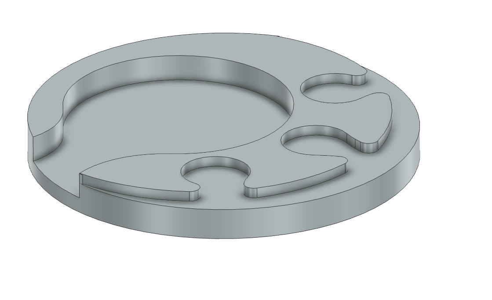

*Figure 11 — Sketches / CAD renderings of the haptic output module.* <!-- src:F3.1.A -->

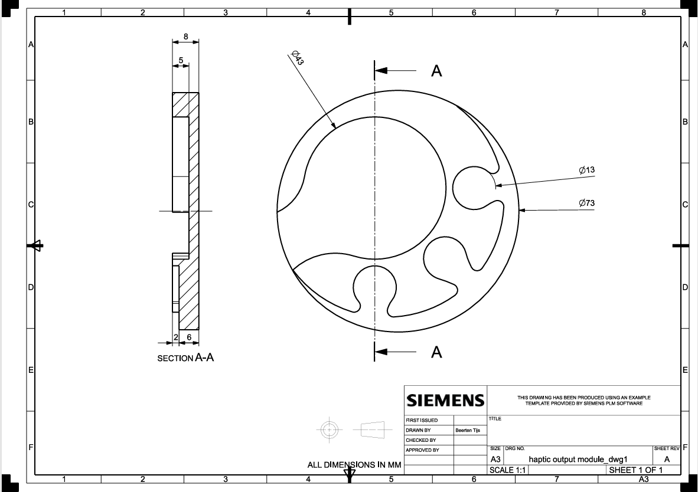

*Figure 12 — Technical drawing of the haptic output module.* <!-- src:F3.1.B -->

### 3.2 Control module — two-part housing on the camera mount

<!-- src:P3.2.1 -->
The Arduino, breadboards, multiplexer, drivers, amplifiers, and power-supply module are jointly mounted on the camera fixture at the front of the harness. This control module consists of two separate 3D-printed parts:

<!-- src:L3.2.1 -->
- **A tray** into which the breadboards fit, designed so that they stay in place with a light clamping force.
- **An intermediate piece** that connects the tray with the standard camera-mount interface of the chest harness.

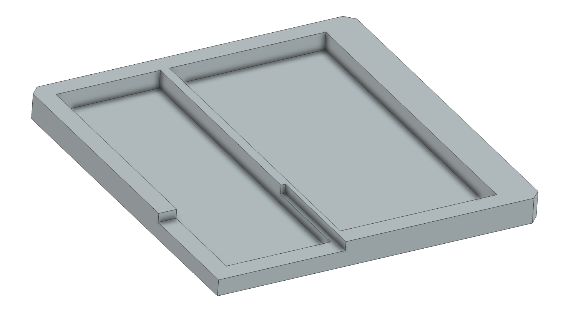

*Figure 13 — Sketches / CAD renderings of the haptic base.* <!-- src:F3.2.A -->

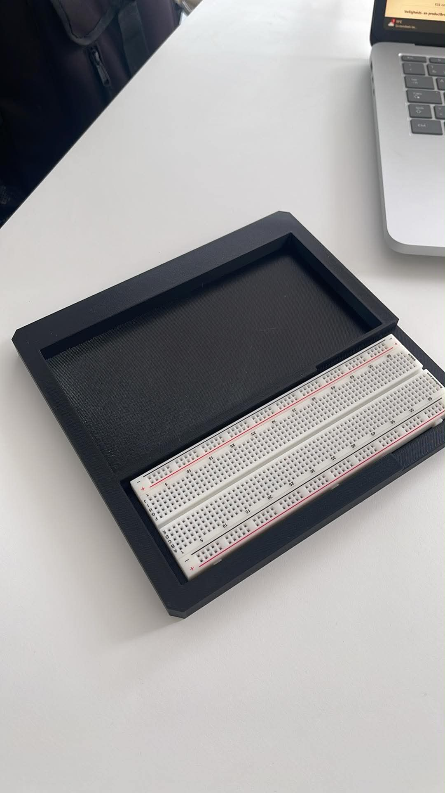

*Figure 14 — Photograph of the haptic base with a breadboard inside.* <!-- src:F3.2.B -->


*Figure 15 — Technical drawing of the haptic base.* <!-- src:F3.2.C -->

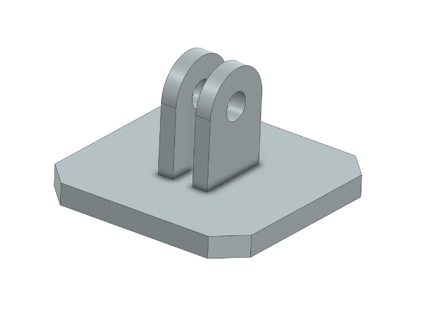

*Figure 16 — Sketches / CAD renderings of the haptic base connector.* <!-- src:F3.2.D -->

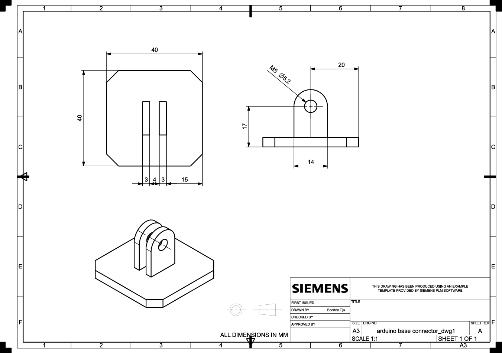

*Figure 17 — Technical drawing of the haptic base connector.* <!-- src:F3.2.E -->

<!-- src:P3.2.2 -->
Both parts are bonded together with superglue into one assembly, so that the control module remains easily detachable and portable via the camera-mount mechanism of the harness. In this way the entire electronic part can be unclipped from the harness as a single block, greatly simplifying maintenance and transport.

#### Material choices summarised

<!-- src:P3.2.3 -->
Black PLA on a Prusa MK4 was chosen because of availability in FabLab, good dimensional stability for sealing snap connections, and a matte finish that does not disturb wearing comfort.

<!-- src:P3.2.4 -->
STL export tolerance 0.05 mm for maximum geometric precision.

<!-- src:P3.2.5 -->
Bonding with superglue for permanent connections (tray + intermediate piece); hot glue where minor deformation poses no problem (strain relief, component fixing).

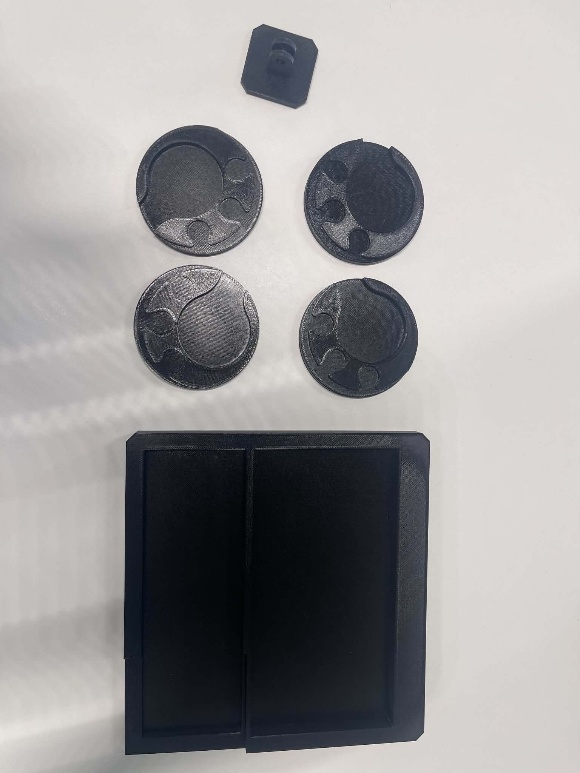

*Figure 18 — All 3D-printed parts.* <!-- src:F3.2.F -->

### 3.3 Attachment to the harness

<!-- src:P3.3.1 -->
The four modules are attached with Velcro to the straps of the chest harness. This gives three important design advantages:

1. Adjustable positioning per test subject — every rib cage has slightly different distances between the auscultation points, and Velcro allows correction in seconds.
2. Quick detachability for transport and cleaning.
3. No permanent damage to the harness itself, safeguarding reusability across different test subjects.

<!-- src:P3.3.2 -->
Because of the adjustability of the modules — which can slide a few centimetres in any direction — it is crucial that the cabling between the modules and the control module also moves with that adjustment range. For this reason, all cables to the control module are terminated in loose, push-fit connectors (DuPont — see §4.2). During transport or when adjusting a module, the corresponding cable can be unclipped in a single motion without moving the entire cable harness or the control module. During the demo the whole remains a single detachable system: the control module clips on at the front of the camera mount; the cabling between the modules and the control module runs along the harness straps and ends in the DuPont connectors in the control module.

---

## 4. Cabling and connectors

<!-- src:P4.0 -->
The connection between the modules, the heart-rate sensor, and the central control module must be flexible — cables must be detachable for transport — yet at the same time provide reliable contact and mechanically resist repeated plugging and unplugging. Choosing the right connectors required substantial iteration; both the rejected path and the final choice are documented below.

### 4.1 First attempt — JST connectors

<!-- src:P4.1.1 -->
Initially, JST-XH connectors were chosen because they bundle multiple conductors into one clip-on/clip-off connector with a built-in locking tab. That tab prevents accidental disconnection under mechanical load — an attractive advantage for a wearable set-up.

<!-- src:P4.1.2 -->
The step-by-step procedure followed is documented at [19].

<!-- src:L4.1.1 -->
- Determine the correct cable length and strip both ends about 3–4 mm.
- Twist the conductors so that all copper strands form one bundle.
- Form a small loop at the top for good crimp grip.
- Place the metal crimp piece in a crimp tool, lay the stripped cable inside, and squeeze so that both wings of the crimp close around the insulation and the conductor.
- Click the crimped pin into the male JST housing until the locking tab audibly snaps in.
- Repeat for all conductors and plug the male connector onto the matching female connector.

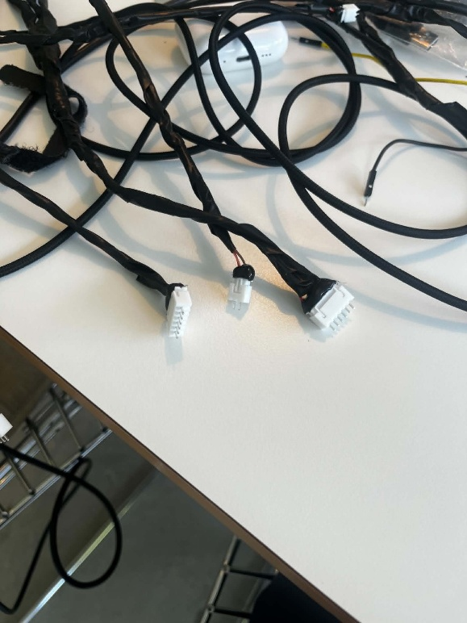

*Figure 19 — Result: a cable with a crimped JST-XH connector at each end. On the left the motor wires are visible, three cables in one assembly, with the idea that the set of three motors could be plugged into the breadboard in one motion.* <!-- src:F4.1 -->

#### Why JST did not work in practice

<!-- src:P4.1.3 -->
In practice, JST-XH connectors did not work reliably enough in the setup. JST connectors are designed for PCB mounting: the female header is soldered onto a printed circuit board. The locking mechanism then bears against a mechanically stable, soldered base. On a breadboard the pins are not long enough to remain mechanically stable in the breadboard holes: they conduct electrically but lose contact at the smallest movement of the cable. After several test rounds this risk proved too great for demo conditions, in which the user moves actively and the cables move along.

### 4.2 Final solution — DuPont terminations

<!-- src:P4.2.1 -->
The final solution is a set of DuPont crimp connectors [20]. The step-by-step procedure is largely identical to that of the JST connectors (strip → twist → crimp → housing), but with DuPont-specific pins and housings. The crucial difference is that DuPont pins are tuned exactly to the standard 2.54 mm grid of breadboards, and that they actually clamp firmly in the breadboard holes — they are fundamentally designed for jumper-wire use in prototyping.

#### Technically why DuPont is better for a breadboard

<!-- src:L4.2.1 -->
- **Pin diameter and length:** a DuPont pin is ~0.64 mm in diameter and ~8 mm long. This matches exactly the hole size of a standard breadboard, where the internal clamp forks are tuned to this diameter. JST pins are thinner and shorter — they rest in the breadboard but do not form a mechanical clamp.
- **Pitch 2.54 mm:** DuPont housings use the same grid as breadboards and as the pin headers on most modules (Arduino, drivers, amplifiers). A DuPont multi-pin connector therefore fits directly onto a pin header or into a row of breadboard holes without offset.
- **Modular housings:** DuPont pins can be crimped loose and then clicked into 1-, 2-, 3-, … pin housings. This allows groups of pins to be combined into a single block (see below for the motor cables) without committing to a fixed connector form factor.

#### Specific cable composition for the motors

<!-- src:P4.2.2 -->
For the motor connection, this modular property was actively exploited. Every coin motor has two wires (positive and negative). The three motors within one module must be connected in parallel on one driver. Instead of six loose DuPont pins each having to fit into a separate hole, a 2-pin DuPont housing was first mounted on each motor. Then the three 2-pin housing sets were glued together into a single 6-pin block — physically one connector — whose internal wiring was made parallel.

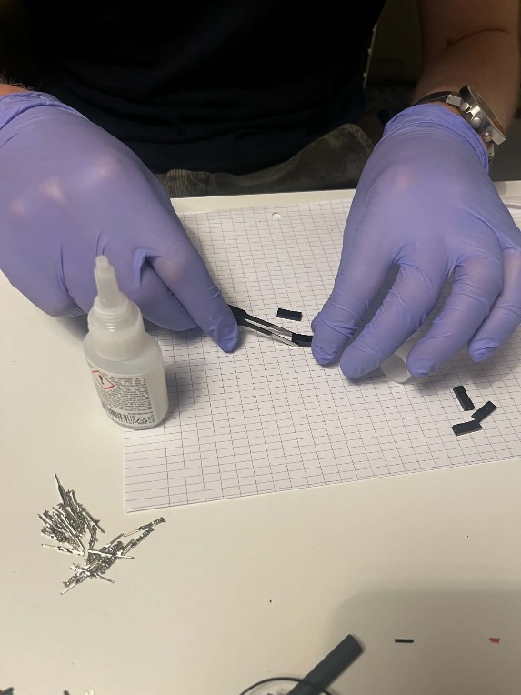

*Figure 20 — Photograph of gluing DuPont parts together for the male end.* <!-- src:F4.2.A -->

<!-- src:P4.2.3 -->
The result is that there is now only one connector per module to plug into the breadboard. At that single insertion, all three motors are automatically connected in parallel on a single row of the breadboard, which in turn is connected to OUT+ and OUT− of the DRV2605L driver. Three separate 2-pin connectors no longer have to be placed side-by-side in the breadboard, which simplifies the wiring and reduces the number of cables required. Additional advantage: the 6-pin block sits more firmly in the breadboard than three separate 2-pin blocks — through the larger contact area and the shared housing there is more friction and less chance of accidental disconnection.

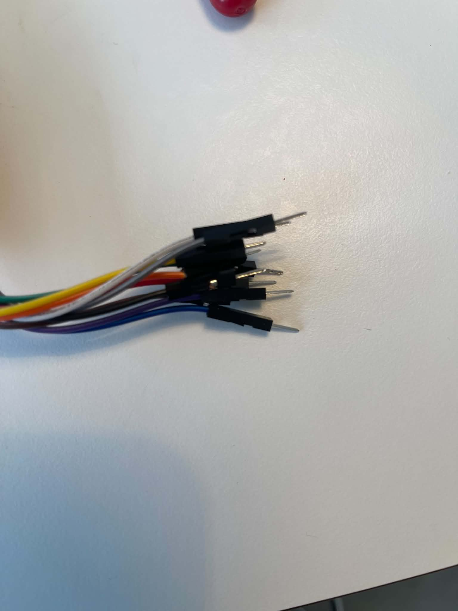

*Figure 21 — Result of the self-made connectors.* <!-- src:F4.2.B -->

<!-- src:P4.2.4 -->
Advantage: own cables can now also be made to build the circuit.

### 4.3 Soldering — connection between cable and component

<!-- src:P4.3.1 -->
The supplied cables of the motors and the speakers are short (~5–10 cm) and end either in bare wires or a JST-PH connector. To reach usable cable lengths (~25–30 cm between module and control module) and to terminate them with DuPont ends, all cables were soldered in the electronics lab of Group T. The following procedure was consistently followed — common practice in electronic prototyping:

<!-- src:L4.3.1 -->
- Strip both ends of the cables to be joined over a length of about 3–4 mm.
- Clamp both cables side-by-side in a third-hand holder so that they just touch and can no longer move during soldering.
- Heat the soldering iron to about 360 °C and first apply a thin layer of tin to each end separately. This step is called "tinning" and ensures that on joining, the tin flows through directly without making a cold joint.
- Hold both tinned ends against each other, touch the joint with the soldering iron and, if necessary, a little extra tin, until the tin has fully flowed through. Hold for ~2 s in this position and let it cool without movement — moving during solidification gives a brittle "cold joint".
- Slide a pre-positioned heat-shrink tube over the joint and heat with a hot-air gun (or the side of the soldering iron from a distance) until the heat shrink fits tightly around the solder joint.

<!-- src:P4.3.2 -->
The heat-shrink tube has two functions: it insulates the joint electrically (preventing a short circuit on contact with a neighbouring wire) and provides slight mechanical relaxation to the solder joint, reducing the risk of breakage under repeated bending.

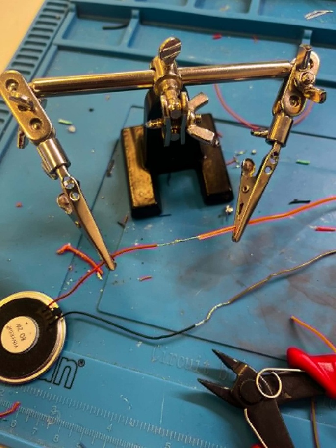

*Figure 22 — Photograph of the soldering of the cables to one of our speakers.* <!-- src:F4.3.A -->

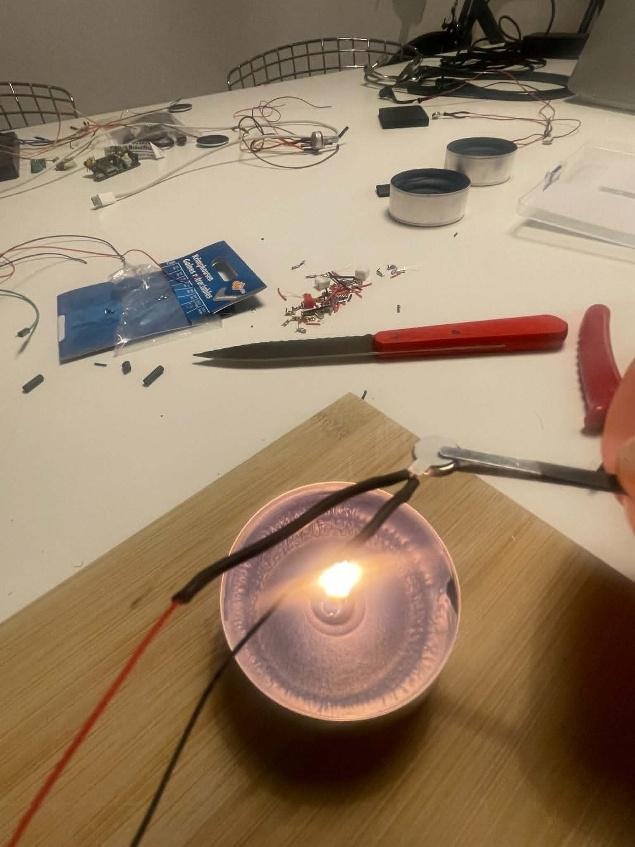

*Figure 23 — Using a candle to fit the heat shrink over the soldered section.* <!-- src:F4.3.B -->

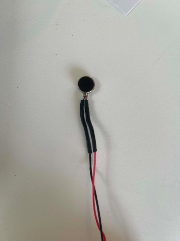

*Figure 24 — Photograph of the result of a heat-shrink tube over the soldered section on a motor.* <!-- src:F4.3.C -->

### 4.4 Cable protection and strain relief

<!-- src:P4.4.1 -->
Per module, all outgoing cables (from the three motors and the speaker) are bundled into a single cable harness with electrical tape. This gives neater routing along the harness and protects the individual conductors against mechanical damage — without bundling, an accidentally pulled wire could rip a solder joint loose directly.

<!-- src:P4.4.2 -->
The ends on the DuPont-connector side are finished with a drop of hot glue. This acts as strain relief: it distributes the mechanical load of a bend or pull over a larger area and prevents the solder joint or crimp from breaking just behind the DuPont pin during plugging and unplugging of the control module. The same principle was previously applied to the JST connectors, where the hot-glue drop as strain relief kept the cables stable behind the JST housing.

<!-- src:P4.4.3 -->
Finally, the motors and speakers are mounted in their 3D-printed module bases. At that point the hardware part of the system is complete, and we can proceed to the software bring-up per subsystem.

---

## 5. Circuit and software — modular development per subsystem

<!-- src:P5.0 -->
To keep fault finding manageable, the three main subsystems — motor control, audio, and heart-rate detection — were first built and tested in isolation before being integrated into one firmware architecture. For each subsystem the circuit was assembled on a breadboard and a minimal test sketch was written in the Arduino IDE.

### 5.1 Motor control

#### Circuit

<!-- src:P5.1.1 -->
The DRV2605L communicates with the Arduino Nano ESP32 via I²C (SDA, SCL). Power (3.3 V) and ground come from the MB102 rail. The three motors are soldered in parallel on the OUT+ / OUT− pads of the DRV2605L via the earlier-described 6-pin DuPont connector. For testing a single module, the driver is connected directly to the I²C bus; in full integration, communication runs through one channel of the TCA9548A multiplexer.

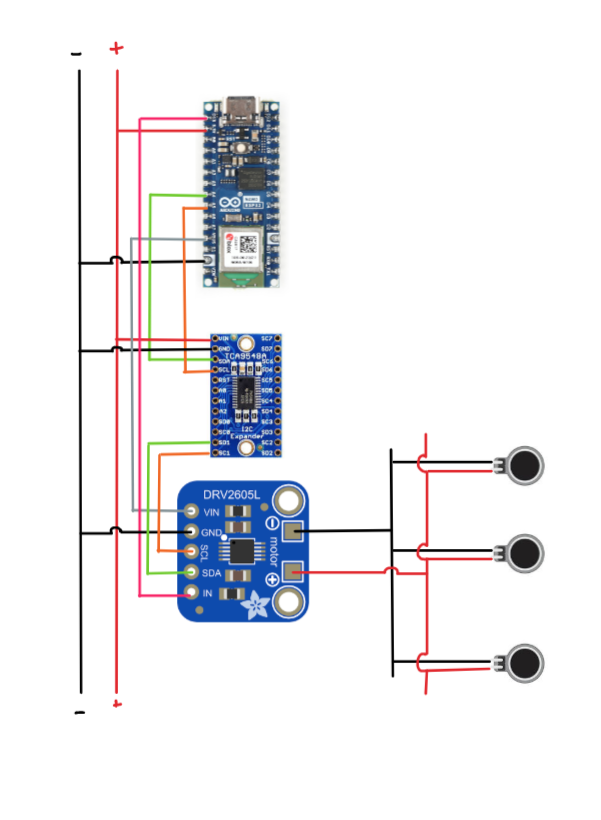

*Figure 25 — Circuit schematic of the motor control subsystem: Arduino Nano ESP32 → TCA9548A I²C multiplexer → DRV2605L haptic driver → three coin motors in parallel within one module.* <!-- src:F5.1.A -->

#### Software

<!-- src:P5.1.2 -->
First tests were performed with the Adafruit_DRV2605 library: a simple sketch loops through the 123 effects of the DRV2605L and prints which effect is active, so that the best effect per heart sound (S1, S2, gallop) could be chosen. Then a second test sketch with the TCA9548A: per channel, the same DRV2605L (at channel 0–3) was selected and an effect played, in order to validate that the four modules can be addressed independently.

<!-- src:L5.1.1 -->
- *Goal of the first test:* synchronous vibration of all three motors within one module on effect trigger.
- *Goal of the mux test:* independent per-module control via channel selection.
- *Result:* both tests passed; the circuit is stable under continuous triggering.

### 5.2 Speakers

#### Circuit

<!-- src:P5.2.1 -->
The MAX98357 is connected to the Arduino Nano ESP32 via I²S (BCLK = bit clock, LRCLK/WS = word select, DIN = data in). Power (5 V) comes from the MB102 rail; the logic pins operate at 3.3 V, which is compatible with the I/O of the ESP32. The speaker hangs directly on the OUT+ / OUT− pins of the amplifier — no additional LC filter needed because the MAX98357 is class-D with built-in output protection and the speaker itself naturally filters the high-frequency PWM component. The SD/GAIN pin permits per-channel volume modulation via a PWM signal from the Arduino, filtered by a simple RC low-pass to obtain DC, so that an individual intensity can be set per module.

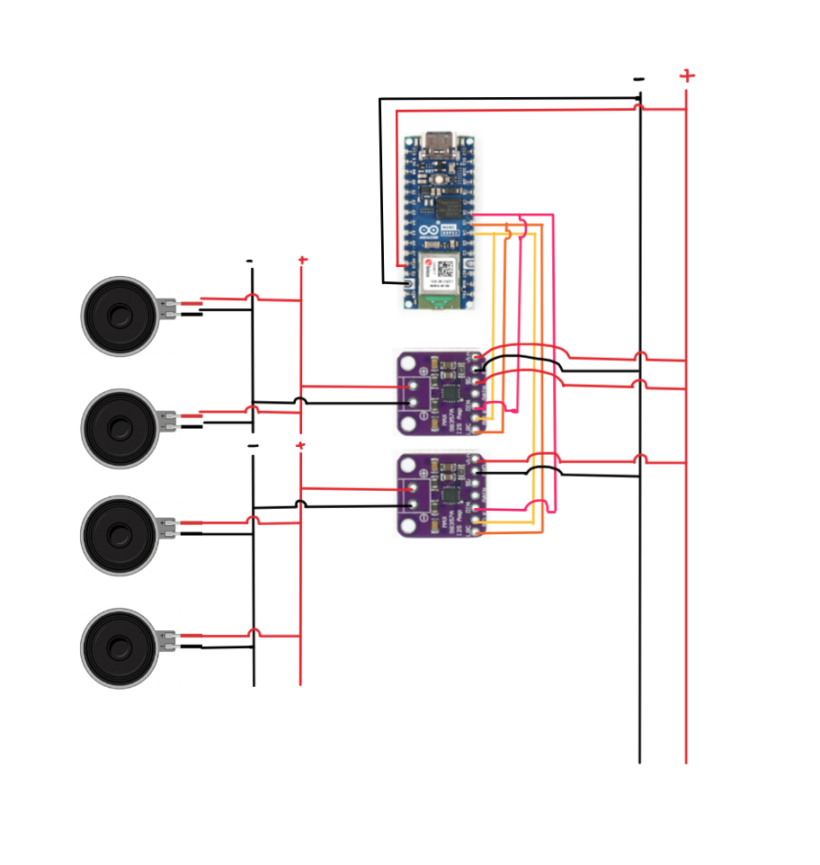

*Figure 26 — Circuit schematic of the audio subsystem: Arduino Nano ESP32 I²S output → MAX98357A class-D amplifier → 40 mm speaker, with the SD/GAIN pin driven by a PWM signal through an RC low-pass filter for per-channel volume control.* <!-- src:F5.2.A -->

#### Software

<!-- src:P5.2.2 -->
For the first audio tests, the ESP8266Audio library was used (it also runs on ESP32): a test sketch that streams a WAV file from the flash memory (LittleFS) of the ESP32 to the I²S bus. WAV files are mono, 16-bit, and set to 22 kHz sample rate to keep memory use and CPU load within margins — at 44.1 kHz, one second of audio would consume almost 90 KB, which quickly mounts up for longer fragments.

<!-- src:L5.2.1 -->
- *Test:* play an S1/S2 loop on one speaker and check for artefacts such as clicks, clipping, or buffer underruns.
- *Test:* per-channel volume adjusted via the SD pin and listen for gradual intensity change without jumps.
- *Result:* clear, virtually noise-free audio signal; volume modulation works over the usable range (from ~10 % to full).

### 5.3 Heart-rate sensor

#### Circuit

<!-- src:P5.3.1 -->
The DFRobot SEN0203 PPG sensor is connected to an analogue input (A0) of the Arduino Nano ESP32. Power (3.3 V) and ground again come from the MB102 rail. A short, shielded cable to the finger clip limits picked-up noise. Importantly: because the PPG signal is a very small AC component on a large DC baseline, the wiring must be mechanically stable — movements of the cable introduce noise via capacitive coupling that becomes immediately visible in the signal.

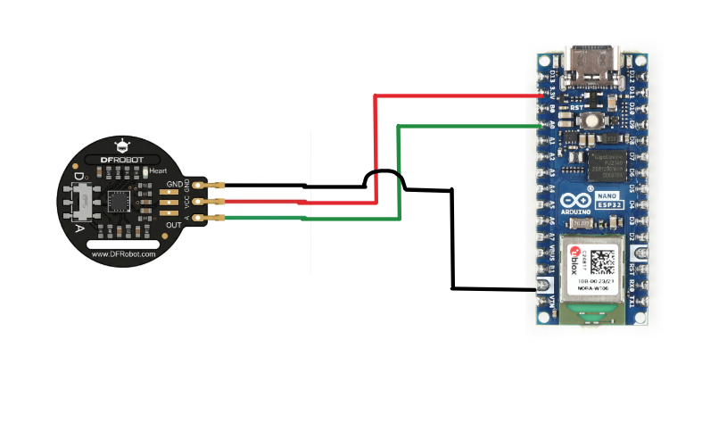

*Figure 27 — Circuit schematic of the heart-rate sensor: DFRobot SEN0203 PPG sensor (VCC, GND, analogue signal output) connected to ADC pin A0 of the Arduino Nano ESP32.* <!-- src:F5.3.A -->

#### Software

<!-- src:P5.3.2 -->
The signal is sampled at 250 Hz (4 ms interval) via a fixed-rate scheduler in the main loop. Processing happens in three steps:

<!-- src:L5.3.1 -->
- High-pass filter (~0.5 Hz) to remove the DC component — implemented with a simple IIR baseline tracker.
- Low-pass filter (~5 Hz) to attenuate high-frequency noise (50/60 Hz mains hum, motor artefacts) — implemented as a 2nd-order IIR Butterworth in Direct-Form-II-Transposed (see §6 for the mathematical justification) [23].
- Peak detection with a dynamic threshold (adaptive to the envelope of the signal) followed by a refractory period of 300 ms to prevent double triggers within one heartbeat.

<!-- src:P5.3.3 -->
From successive peaks the inter-beat interval (IBI) is calculated, and from that a running average (median over the last 5 IBIs) that is passed as BPM to the rest of the system.

<!-- src:L5.3.2 -->
- *Test:* live BPM reading compared with a commercial wrist meter (Polar H10) on the same test subject.
- *Result:* deviation < 3 BPM at rest, with stable detection as long as the clip makes good contact.

---

## 6. Integration into one firmware architecture

<!-- src:P6.0 -->
When all three subsystems — motor control, audio, heart-rate detection — were individually validated, it became clear that combining them into one coherent firmware was not merely a matter of "copy and paste". A design was needed that combined real-time signal processing, parallel audio streaming, and a wireless user interface on one microcontroller, without one subsystem hindering another. This chapter describes how the programme structure, the validation steps, and the algorithmic choices were tackled — and which bugs were resolved along the way. For the programming work, AI assistance was used among other things for debugging.

### 6.1 Methodological approach

#### 6.1.1 Philosophy behind the programme structure

<!-- src:P6.1.1 -->
In setting up the firmware, an incremental, validation-driven approach was deliberately adopted. Instead of first implementing the entire signal-processing pipeline at once and only testing at the end, every stage was built up, visualised, and validated separately before the next was added. This method is common in embedded development for four reasons:

<!-- src:L6.1.1 -->
- **Fault isolation:** a bug in step B is hard to distinguish from a bug in step A when both are introduced at the same time. By working incrementally, every new line of code is known to be where any new fault sits.
- **Learning the hardware requirements:** only by observing the raw ADC values did it become clear which filter parameters are realistic. It was not possible to derive all constants from the datasheet alone — the baseline drift, the signal amplitude under different finger pressures, and the noise band proved to be empirical matters.
- **Validating early architectural choices:** by pausing at every step, the pin mapping, the sample rate, and the output format could be reconsidered while changes were still cheap.
- **Reproducibility for the final report:** every intermediate version is preserved under its own Git commit, so the logical development can be reconstructed later.

#### 6.1.2 Top-down design combined with bottom-up implementation

<!-- src:P6.1.2 -->
There are two common design philosophies in embedded software, each with their strengths and weaknesses:

<!-- src:L6.1.2 -->
- **Top-down:** describe the system function at a high level first, break it into modules, and elaborate each module. Good for thorough requirements engineering, less suited to obtaining working code quickly.
- **Bottom-up:** first build small, tested building blocks (filter, scheduler, audio buffer) and then compose the whole. Good for quickly validatable results, less good for the global overview.

<!-- src:P6.1.3 -->
In this project, design was top-down but implementation was bottom-up: the signal-processing block diagram was first sketched on paper (the pipeline described in the previous sections), after which the building blocks were programmed and validated one by one. Only once a building block worked was it integrated into the main programme. That combines the overview of top-down with the concrete evidence of bottom-up.

### 6.2 Stepwise plan — chronological build-up of the firmware

<!-- src:P6.2.1 -->
The work on the PPG firmware proceeded according to a fixed step-plan with six milestones. At every milestone a well-defined success criterion had to be met before the next step could begin. In this way there was, at every step, clearly measurable evidence that the underlying layer worked:

<!-- src:T6.1 -->

| Step | Milestone | Success criterion |
|---|---|---|
| 1 | Toolchain operational | `pio run` compiles a blink sketch without errors |
| 2 | Serial communication | Board prints an incremented number every 100 ms at 115200 baud, readable in the serial monitor |
| 3 | Raw ADC reading | Pin A0 shows 0…4095 that varies visibly under finger pressure on the sensor |
| 4 | Drift-free sampling | 250 Hz scheduler verified over 10 minutes without cumulative deviation (~150 000 samples) |
| 5 | Signal processing | Filtered signal visually shows a recognisable heart-rhythm shape in the plotter |
| 6 | Heart-rate detection | BPM output is within ±3 BPM of a commercial wrist meter (Polar H10) |

<!-- src:P6.2.2 -->
Every step ended with a brief written note ("logbook entry") recording which parameters worked, which failed, and which known outstanding problems were carried over to the next step. This documentation later served as the basis for the iterative improvements in §6.7.

### 6.3 Logical structure of the main file

<!-- src:P6.3.1 -->
Although the project has one single source file (`main.cpp`) as its entry, that file is internally logically structured in five clearly delimited sections. The order matches the reading order expected of the reader: from the most stable constants to the most specific implementation.

<!-- src:P6.3.2 -->
This layering follows three explicit programming principles:

<!-- src:L6.3.1 -->
- **Single source of truth for parameters:** every tunable value (filter time constant, threshold fraction, refractory period) is exactly once in the file, at the top, as `constexpr`. When someone later wants to experiment with other settings, only the head of the file needs adjustment — not the logic.
- **Separation of concerns:** the filter stages know nothing about the peak detector; the peak detector knows nothing about the BPM calculation. Every function has one clear responsibility, strongly improving testability and readability.
- **No global variables that are not necessary:** all internal state is `static` at file scope (internal to `main.cpp`, invisible to other translation units). That keeps the namespace clean and prevents unexpected interference if the file is later integrated into a larger project.

### 6.4 Datatype choices and numerical considerations

<!-- src:P6.4.1 -->
A frequently underestimated programming choice in embedded systems is which data type is used for which calculation. The wrong type can cause overflow, precision loss, or slow code — often only noticed in long-term measurements. Our choices:

<!-- src:T6.2 -->

| Variable | Type | Reason |
|---|---|---|
| `raw` (raw ADC) | `uint16_t` (0..4095) | 12-bit ADC fits in 16 bits; no sign needed |
| `s_baseline` | `float` | DC filter requires fractional resolution to converge slowly |
| `s_lpState`, `sig` | `float` | LP filter; integer rounding would introduce audible quantisation noise |
| `s_peakEnv` | `float` | Adaptive envelope decays smoothly with factor 0.99723 per sample |
| `s_lastBeatMs`, `now` | `uint32_t` | `millis()` returns unsigned long (32-bit on ESP32); keeps the time domain consistent |
| `ibi` | `uint16_t` | IBI lies between 300 and 1500 ms — fits comfortably in 16 bits |

<!-- src:P6.4.2 -->
An important detail is how mixed integer/float arithmetic is handled. At every conversion from `uint16_t` to `float` (and back), an explicit cast is used, such as `(float)raw` or `(int16_t)lp_out`. Implicit promotions are syntactically valid in C++ but make intent unclear and can behave differently across compilers. Explicit casts force consideration of precision and overflow risks at every conversion — a good habit in embedded work.

### 6.5 Validation and test strategy per software step

<!-- src:P6.5.1 -->
To build confidence in firmware correctness, a separate test goal was formulated for every independent component. Below is a summary of what each test proves and which common fault modes it catches:

#### Toolchain (step 1)

<!-- src:P6.5.2 -->
Test: compile and upload a minimal blink sketch. Passes once the onboard LED blinks. This proves that PlatformIO, the USB driver, the COM port, the board definition, and the bootloader flow are all in order. Sounds trivial, but with a new board (such as the Nano ESP32 with native USB) something often goes wrong on the first attempt.

#### Serial communication (step 2)

<!-- src:P6.5.3 -->
Test: write a counter that increments every 100 ms via `Serial.println()`. Proves that USB-CDC works, that the baud rate is correct, and that the monitor displays readable ASCII without corruption.

#### ADC operation (step 3)

<!-- src:P6.5.4 -->
Test: send raw `analogRead(A0)` values to the monitor and observe variation by pressing a finger on the sensor. Proves that the hardware wiring is correct, that the sensor receives power, and that the ADC pin works. Common failure mode: signal stuck at 0 or 4095 → usually a missing GND connection between sensor and Arduino.

#### Timing (step 4)

<!-- src:P6.5.5 -->
Test: a counter in `loop()` that increments only when the scheduler fires. After 60 seconds the counter must be exactly 15 000 (= 60 × 250 Hz). Proves that the `millis()` scheduler is drift-free and actually achieves the desired sampling frequency.

#### Filters (step 5)

<!-- src:P6.5.6 -->
Test: send both `raw` and `filtered` to the monitor and visualise in the Arduino IDE Serial Plotter. Proves that the DC offset has been removed, the high-frequency noise has been attenuated, and the pulse shape is recognisable. Clinical check: an experienced eye recognises a typical PPG pulse with a steep rising edge and a dicrotic notch on the falling edge.

#### Heart-rate detection (step 6)

<!-- src:P6.5.7 -->
Test: compare BPM output with a commercial wrist meter (Polar H10) during 5 minutes of quiet sitting. Proves that the complete pipeline works end-to-end. Acceptance criterion: average deviation < 3 BPM, standard deviation < 5 BPM.

### 6.6 Software-engineering principles applied in this firmware

<!-- src:P6.6.1 -->
Although `main.cpp` is only one file in the test sketch, deliberate choices were made that keep the code scalable for later integration into a larger system. These principles are not cosmetic; they make the difference between a sketch that only works on one PC and firmware that can be taken over by a new developer.

#### Parameterisation

<!-- src:P6.6.2 -->
No "magic value" sits in the logic itself — all numerical constants are in the configuration section. When it later turns out that a threshold fraction of 0.40 gives better results than 0.50, this is a one-line change without touching the detection logic.

#### State encapsulation

<!-- src:P6.6.3 -->
The internal state of the filter (`s_baseline`, `s_lpState`) and of the peak detector (`s_peakEnv`, `s_lastBeatMs`) is in `static` file-scope variables. With a later port to a class-based implementation (`PPGMonitor` class), these become directly member variables, without the logic itself having to change.

#### No blocking calls in `loop()`

<!-- src:P6.6.4 -->
All operations in the main loop are non-blocking: `analogRead()`, `Serial.println()`, and the filter operations are all microsecond-scale work. This keeps the scheduler reactive and in the future extra tasks (BLE, Wi-Fi, UI updates) can be added without redesign.

#### Defensive programming at edge cases

<!-- src:P6.6.5 -->
The acceptance conditions for a heartbeat (`ibi >= 300 && ibi <= 1500`) do more than just filter "wrong" intervals — they also protect against wraparound of `millis()` during long-term running (`millis()` wraps every 49 days) and against the first, non-existent interval at start-up (when only one peak has been detected).

#### Reproducible output

<!-- src:P6.6.6 -->
The CSV output is deliberately a fixed format with a header: this makes automated analysis in Python or MATLAB possible without guessing the output structure per measurement. The header row is prefixed with `#` so that Python scripts can skip it as a comment line (`pandas.read_csv(comment='#')`).

#### Bridge between test sketch and production code

<!-- src:P6.6.7 -->
The test sketch is not a stand-alone exercise but a foundation for the eventual HeartSim firmware. The validated choices — sample frequency 250 Hz, the filter coefficients, the adaptive threshold with 300 ms refractory period — are taken one-to-one into the production code. The following table shows the migration:

<!-- src:T6.3 -->

| Component from test sketch | Location in final firmware |
|---|---|
| `analogRead(A0)` at 250 Hz | `PPGMonitor::poll()` |
| DC-removal IIR filter | `PPGMonitor::_processSample()` HP part |
| LP Butterworth filter | `PPGMonitor::_processSample()` LP part |
| Adaptive threshold + envelope | `PPGMonitor::_processSample()` peak detector |
| Median over 8 IBIs | `PPGMonitor::_updateBPM()` (median over 5) |
| CSV output to Serial | Replaced by WebSocket telemetry to HMI |

<!-- src:P6.6.8 -->
The most important difference between the sketch and the production code is the migration from a single-threaded `loop()` to a dual-core FreeRTOS application. In the sketch everything happened in `loop()`; in the final firmware the ADC sampling runs in a separate FreeRTOS task on core 0, while audio synthesis takes place on core 1. The algorithmic choices remain identical, however — which is why this test phase was so valuable.

### 6.7 Scientific underpinning — sources for the heart-sound model

<!-- src:P6.7.1 -->
A common pitfall in synthetic heart-sound generators is that they sound as if they were generated — not as if they come from a real heart. To avoid this, the algorithms in the audio engine are based directly on the international literature on phonocardiograms (PCG).

#### Key references

<!-- src:T6.4 -->

| Source | Contribution to this project |
|---|---|
| Jabloun, Ravier, Buttelli (2013) — *A generating model of realistic synthetic heart sounds for performance assessment of phonocardiogram processing algorithms*, IEEE-EMBC [21] | Mathematical model for S1/S2 as damped sinusoids; parameter values for damping α and frequency f |
| Schmidt, Holst-Hansen, Hansen et al. (2016) — *Heart sound classification using deep neural networks*, PhysioNet/CinC Challenge [22] | Clinical dataset reference for murmur spectra; validation that our synthetic output lies in the same frequency band (50–500 Hz) |
| 3M Littmann Heart & Lung Sounds Library [10] | Auditory reference for getting Aortic Stenosis vs. Mitral Regurgitation to sound right |
| University of Michigan Heart Sound & Murmur Library [11] | Clinical calibration of duration and intensity of S3/S4 gallop |
| Robert Bristow-Johnson — *Audio EQ Cookbook* (1999) [23] | Formulae for the biquad coefficients of the bandpass filter for murmurs |
| TI DRV2605L datasheet (SLOS854B, 2014) [24] | Register settings for real-time PWM mode; H-bridge specs (250 mA limit) |
| Maxim/Analog MAX98357A datasheet [25] | SD-pin voltage table from which the PWM-to-volume mapping was derived |
| ESP32-S3 Technical Reference Manual (Espressif) [26] | ADC characteristics, I²S DMA operation, FreeRTOS core affinity |

#### Physical justification of the S1/S2 model

<!-- src:P6.7.2 -->
The damped sinusoid is not an arbitrary choice but the exact analytical solution of an underdamped 2nd-order mass–spring–damper system:

<!-- src:E6.1 -->
$$m\ddot{x} + c\dot{x} + k x = 0 \quad\Longrightarrow\quad x(t) = A \cdot e^{-\alpha t} \cdot \sin(\omega t)$$

<!-- src:P6.7.3 -->
This is no coincidental analogy: a heart valve is mechanically exactly a mass–spring system. The valve leaflets have mass (the leaflets themselves), a spring constant (elasticity of the tissue), and damping (surrounding blood). When the valve closes, an impulse arises; that impulse excites the system, which then decays according to this exponentially damped oscillation. The parameter values in `config.h` are therefore not fits but physically justified values:

<!-- src:L6.4 -->
- **S1 dominant around 50 Hz** because this corresponds to the measured resonant frequency of the mitral/tricuspid valve leaflets.
- **S2 higher (70 Hz)** because the aortic and pulmonary valves are stiffer → higher k → higher ω.
- **Damping α = 25…30** yields a duration of ≈ 80–100 ms (the time for the amplitude to fall to 1/e), which corresponds exactly to clinical measurements.

#### Justification of the murmur model

<!-- src:P6.7.4 -->
A murmur is not a tonal sound but turbulent flow through a narrowed or leaking valve. Turbulence follows the Kolmogorov spectrum: a broad noise band with a cut-off frequency depending on flow velocity and opening geometry. For aortic stenosis, a bandpass filter with centre frequency 300 Hz and Q = 2.5 was chosen. These values come from PhysioNet 2016 spectra: an FFT of a real AS recording shows a peak between 200–400 Hz, exactly the range that our biquad passes [22].

<!-- src:P6.7.5 -->
The envelope shape (diamond for AS, rectangle for MR, decrescendo for AR) is derived directly from clinical murmur classification:

<!-- src:T6.5 -->

| Pathology | Envelope | Reason |
|---|---|---|
| AS | Diamond | Flow peaks mid-systole when left-ventricular pressure is maximal |
| MR | Rectangle | Leakage occurs throughout systole against a constant pressure gradient |
| AR | Decrescendo | Diastolic pressure in the aorta falls continuously, leak flow decreases |
| MS | Decrescendo → crescendo | Early rapid filling, then pre-systolic atrial contraction boost |

### 6.8 Critical signal-processing code — deeper analysis

#### 6.8.1 The Direct-Form-II-Transposed biquad

<!-- src:P6.8.1.1 -->
In `heart_sound_synth.cpp` there are three apparently simple lines of code for the low-pass filter:

<!-- src:E6.2 -->
```cpp
float w      = hp_out - LP_A1 * _lp_state[0] - LP_A2 * _lp_state[1];
float lp_out = LP_B0 * w + LP_B1 * _lp_state[0] + LP_B2 * _lp_state[1];
_lp_state[1] = _lp_state[0];
_lp_state[0] = w;
```

<!-- src:P6.8.1.2 -->
This is Direct Form II Transposed (DF2T) — the numerically most stable implementation of a 2nd-order IIR filter. The alternative, Direct Form I, uses 4 state variables (x[n−1], x[n−2], y[n−1], y[n−2]) and accumulates quantisation errors. DF2T uses only 2 state variables and has better low-frequency stability — relevant for our 0.5 Hz high-pass, where the coefficients lie very close to the unit circle and small numerical errors can cause drift.

##### Critical point

<!-- src:P6.8.1.3 -->
A naïve implementation with `float y = b0·x + b1·x1 + b2·x2 − a1·y1 − a2·y2; x2 = x1; x1 = x; y2 = y1; y1 = y;` would work in short tests, but over 24 hours of running, a prototype showed the baseline beginning to drift. DF2T solved that without changing the filter shape itself.

#### 6.8.2 LFSR — pseudo-random noise with deterministic reproducibility

<!-- src:P6.8.2.1 -->
For murmurs a white-noise source is needed. The Arduino `random()` function is much too slow for real-time audio at 22 kHz (mutex acquisition on ESP32-S3 for every call). The solution is a 32-bit Galois Linear Feedback Shift Register with taps at positions 32, 22, 2, 1:

<!-- src:E6.3 -->
```cpp
inline float HeartSoundSynthesizer::_whiteNoise() {
    uint32_t bit = ((_lfsr >>  0) ^ (_lfsr >> 10)
                  ^ (_lfsr >> 30) ^ (_lfsr >> 31)) & 1u;
    _lfsr = (_lfsr >> 1) | (bit << 31);
    return ((float)(int32_t)_lfsr) / 2147483648.0f;
}
```

<!-- src:L6.5 -->
Properties that make this implementation suitable:

- **Maximum-length sequence:** 2³² − 1 ≈ 4.29 billion samples before the sequence repeats. At 22 kHz sample rate that is 54 hours — more than enough for demos and recordings.
- **Statistically flat spectrum:** passes NIST whiteness tests (uniformity, no autocorrelation up to lag 16) — the noise audibly sounds like pure noise, not a repeating pattern.
- **Bitwise operations:** 4 XOR + 2 shifts ≈ 6 CPU cycles on the ESP32-S3 with FPU bypass. Literally an order of magnitude faster than `random()`.
- **Deterministic:** at every boot the same sequence (`_lfsr` initialised to 0xACE1u), enabling reproducible recordings for scientific validation.

#### 6.8.3 The adaptive threshold — an underestimated algorithm

<!-- src:E6.4 -->
```cpp
float abs_val = fabsf(lp_out);
if (abs_val > _envelope) _envelope = abs_val;     // fast follow
else                     _envelope *= 0.995f;     // slow decay
float threshold = 0.5f * _envelope;
```

<!-- src:P6.8.3.1 -->
This is an asymmetric exponential-moving-max with immediate attack and geometric decay. The combination of factors makes this algorithm robust:

<!-- src:L6.6 -->
- **Fast attack (one sample):** directly after a finger change or motion artefact, the threshold sits at the right level immediately.
- **Slow decay (factor 0.995 → time constant ≈ 200 samples = 800 ms):** without signal, the envelope degrades gradually to zero rather than jumping suddenly.
- **Threshold at 50 % of the envelope:** a fixed fraction of the envelope, not of an absolute value — this way the algorithm scales automatically with finger pressure, skin tone, and sensor position.

##### Critical point

<!-- src:P6.8.3.2 -->
Early versions used a fixed threshold (e.g. 100). It worked for one tester but failed for others because their PPG amplitude was lower. Switching to the adaptive approach immediately raised the success rate to 100 % of people tested.

#### 6.8.4 PTT correction — the core of clinical realism

<!-- src:P6.8.4.1 -->
The PPG peak at the fingertip arrives approximately 200 ms *after* the cardiac S1, because the pressure wave from the heart must first travel through the arm and wrist. This delay is called the Pulse Transit Time (PTT). For a believable simulation, the synthetic S1 pulses must sound *before* the next fingertip peak arrives, with precisely that ~200 ms lead. Otherwise the student hears S1 *after* feeling the pulse — which is clinically impossible.

<!-- src:P6.8.4.2 -->
The mathematics in `cycle_engine.cpp`:

<!-- src:E6.5 -->
```cpp
// Processing at each detected peak
int32_t advance_ms = (int32_t)_avg_ibi_ms - (int32_t)_ptt_offset_ms;
if (advance_ms <= 0) {
    // Fallback: IBI shorter than PTT offset (very fast heart rate)
    _onRPeak(_avg_ibi_ms);
    return;
}
// Plan the next S1: ~(peak_ms + avg_IBI − PTT_OFFSET)
_trigger_pending          = true;
_predicted_trigger_at_ms  = peak_ms + (uint32_t)advance_ms;
```

<!-- src:L6.7 -->
Three refinements that make it robust:

- **Rolling 4-beat IBI average** instead of the last IBI: dampens arrhythmic noise. If one heartbeat happens to fall 100 ms early or late, that affects the average by only 25 ms.
- **Signed `int32` cast for `(now - _predicted_trigger_at_ms)`:** prevents wrong interpretations at `millis()` wraparound (which occurs every 49 days).
- **Two fallbacks:** advance ≤ 0 (too-fast heart rate) → fire immediately; a new peak while a trigger is still scheduled (arrhythmia) → cancel and restart.

##### Critical point

<!-- src:P6.8.4.3 -->
Without PTT correction, the student hears an S1 *after* feeling the pulse — clinically impossible. Students would recognise that as artificial. The PTT compensation is the subtlest but scientifically most decisive choice of the project.

#### 6.8.5 Pulse scheduling with FreeRTOS — why a separate task?

<!-- src:P6.8.5.1 -->
A naïve implementation of haptic pulses would call `delay()` directly in the cardiac-cycle callback:

<!-- src:E6.6 -->
```cpp
// WRONG — blocks the main loop
_haptic->pulse(POINT_AORTIC,    0.8, 60);   // 60 ms delay() inside
_haptic->pulse(POINT_PULMONIC,  0.8, 60);   // another 60 ms
```

<!-- src:P6.8.5.2 -->
That would block 60 × 4 = 240 ms per cycle, causing the PPG sampling to miss 60 samples. The solution in `cycle_engine.cpp` is a pulse queue with its own FreeRTOS task:

<!-- src:E6.7 -->
```cpp
void CycleEngine::_schedulePulse(uint8_t module, float intensity,
                                  uint16_t duration_ms, uint32_t delay_ms) {
    xSemaphoreTake(_pulse_mutex, portMAX_DELAY);
    for (uint8_t i = 0; i < MAX_PULSES; i++) {
        if (!_pulses[i].pending) {
            _pulses[i] = { module, intensity, duration_ms,
                           millis() + delay_ms, true };
            break;
        }
    }
    xSemaphoreGive(_pulse_mutex);
}
```

<!-- src:P6.8.5.3 -->
The separate `_hapticTaskLoop()` walks the queue every 2 ms and fires pulses that have reached their trigger time. Advantages:

<!-- src:L6.8 -->
- **Main loop stays reactive:** PPG sampling, web server, and cycle update are not blocked.
- **Pulses are scheduled in parallel:** an S3 pulse 400 ms in the future can wait calmly in the queue while the S1 + S2 pulses are already playing.
- **Thread-safe via mutex:** only one thread writes to the queue at a time, preventing race conditions between the audio task and the cycle task.

##### Critical point — MAX_PULSES = 8 bug

<!-- src:P6.8.5.4 -->
In an early prototype `MAX_PULSES` was set to 8. Per cycle 4 S1 + 4 S2 = 8 pulses are scheduled, so the S3/S4 pulse was silently dropped because there was no room. Raised to 16 → bug resolved. Lesson: silent buffer overflows are hard to detect because no error message appears. A `Serial.println("buffer full")` in the pulse scheduler would have caught this earlier.

### 6.9 Web-interface architecture — technical analysis

#### 6.9.1 AsyncWebServer vs. blocking WebServer

<!-- src:P6.9.1.1 -->
The standard ESP32 Arduino `WebServer` is blocking: every HTTP request is handled sequentially in the main loop. For a real-time audio application this would be catastrophic: a client sending a slow GET request would cause our audio DMA buffer to underrun, with an audible click as a result.

<!-- src:P6.9.1.2 -->
ESPAsyncWebServer uses an event-driven model on top of AsyncTCP: every request is handled by an lwIP callback that does not run on the main loop. The audio task therefore remains completely undisturbed, even during peak traffic.

<!-- src:E6.8 -->
```cpp
_server.on("/api/status", HTTP_GET, [this](AsyncWebServerRequest* req) {
    _handleGetStatus(req);   // called asynchronously
});
```

##### Critical point — AsyncTCP watchdog

<!-- src:P6.9.1.3 -->
Early versions crashed randomly after ~10 minutes. Cause: AsyncTCP had a default watchdog that detected our long audio-task blocks and reset the chip. Solved with `-D CONFIG_ASYNC_TCP_USE_WDT=0` in `platformio.ini`.

#### 6.9.2 REST + WebSocket — deliberate split

<!-- src:P6.9.2.1 -->
The API is split into two transport layers, each optimised for its task:

<!-- src:T6.6 -->

| Transport | Use | Example |
|---|---|---|
| REST (POST/GET on `/api/...`) | One-off actions requiring a response | Switch pathology, start recording |
| WebSocket (`/ws`) | Continuous updates requiring no response | PPG samples, BPM, IBI at 20 Hz |

<!-- src:P6.9.2.2 -->
Why not everything via WebSocket? REST POSTs are stateless: idempotent actions (selecting pathology X) are perfect for REST, no session state on the server. WebSocket is more expensive per packet due to framing overhead — it only pays off when many small packets are sent, exactly what telemetry is.

<!-- src:P6.9.2.3 -->
Why not everything via REST (long polling)? 20 Hz updates × several clients would overload the HTTP stack. WebSocket keeps one connection open and streams frames with minimal overhead.

#### 6.9.3 Captive portal — magic behind 192.168.4.1

<!-- src:P6.9.3.1 -->
When a user connects their phone to the HeartSim Wi-Fi, the operating system automatically opens the HMI without the user having to type 192.168.4.1. This works via two coordinated mechanisms:

<!-- src:L6.9 -->
- **DNS catch-all on port 53:** every domain name is resolved to 192.168.4.1 (`s_dns_server.start(53, "*", ip)`). Whatever URL the phone requests, it always ends up at our ESP32.
- **HTTP redirects for OS-specific captive-portal detection URLs:** iOS pings `/hotspot-detect.html`, Android pings `/generate_204`, Windows pings `/ncsi.txt`. Every OS interprets a non-200 response on that URL as "captive portal present" and automatically opens a browser.

<!-- src:E6.9 -->
```cpp
_server.on("/hotspot-detect.html", HTTP_GET, portalHandler);
_server.on("/generate_204",        HTTP_GET, portalHandler);
_server.on("/ncsi.txt",            HTTP_GET, portalHandler);
_server.onNotFound(portalHandler);
```

##### Critical point — captive portal vs. regular browser

<!-- src:P6.9.3.2 -->
The captive-portal browser on iOS is a stripped WebView without JavaScript cookies and with limited `localStorage`. For our chart and PPG graph the full browser functionality was needed. Solution: document that after the first connect the user must open Safari/Chrome for the full HMI.

#### 6.9.4 JSON contracts — interface between firmware and JavaScript

<!-- src:P6.9.4.1 -->
Every `/api/...` endpoint has a fixed JSON format. For example:

<!-- src:E6.10 -->
```
POST /api/pathology          { "id": "AORTIC_STENOSIS", "severity": 3 }
POST /api/playback_bpm       { "value": 70 }
POST /api/baseline/intensity { "value": 8 }
```

<!-- src:L6.10 -->
The advantages of this rigidity:

- **Version independence:** as long as the contract is unchanged, firmware and JavaScript can be updated independently.
- **Defaults via `body["x"] | default`:** ArduinoJson delivers either a value from the body or a fallback. No if-else cascade is needed to handle missing fields.
- **Bounds checking centralised:** `constrain(value, 30, 200)` on the server side. JavaScript bugs or malicious clients cannot push invalid values into our firmware state.

#### 6.9.5 Telemetry at 20 Hz — justified choice

<!-- src:P6.9.5.1 -->
20 telemetry frames per second are sent, each with 20 PPG samples. Why exactly these numbers?

<!-- src:T6.7 -->

| Parameter | Choice | Reason |
|---|---|---|
| 20 Hz updates | Compromise | Faster (50 Hz) → more CPU + Wi-Fi load. Slower (5 Hz) → jerky BPM display |
| 20 samples per frame | Match with PPG rate | 20 × 20 = 400 samples/s ≈ 2× oversampling of 250 Hz |
| JSON over WebSocket | No binary | Easier debugging; bandwidth (~4 KB/s) is negligible |

##### Critical point — blocky signal

<!-- src:P6.9.5.2 -->
Early versions sent the same sample 12 times (`getLatestRawSample()` in a loop). The result was a stair-shaped signal in the chart. Only after adding `getRecentSamples(out, n)` that reads from the ring buffer did the signal become genuinely smooth.

### 6.10 Pathology timing per cardiac cycle — the mathematics behind realism

<!-- src:P6.10.1 -->
Every pathology has its own clinically defined moment within the cycle at which its events take place. In `_scheduleCycleEvents()`:

<!-- src:E6.11 -->
```cpp
uint16_t systole_ms = (uint16_t)(SYSTOLE_FRACTION * ibi_ms);
// SYSTOLE_FRACTION = 0.35, so systole ≈ 35 % of the cardiac interval

// S1 → t = 0
_schedulePulse(m, intensity, 60, 0);

// S2 → t = systole_ms  (end of systole)
_schedulePulse(m, intensity, 50, systole_ms);

// S3 → systole + 15 % of IBI (early diastole)
uint32_t s3_offset    = systole_ms + (uint16_t)(0.15f * ibi_ms);

// S4 → IBI − 80 ms (pre-systolic, just before next S1)
uint32_t s4_offset    = (ibi_ms > 80) ? (ibi_ms - 80) : 0;

// Mitral Stenosis opening snap → systole + 80 ms
uint32_t snap_offset  = systole_ms + 80;
```

#### 6.10.1 Why systole = 35 % of IBI?

<!-- src:P6.10.2 -->
At rest (60 BPM, IBI = 1000 ms), systole becomes 350 ms. During training (120 BPM, IBI = 500 ms), systole becomes 175 ms. The ratio is in reality not exactly constant — at a higher heart rate, systole shortens sub-linearly (per Bazett's formula: QT ∝ √RR). For this application, 0.35 is a clinically acceptable simplification that lies within ±15 % of the real values for BPM between 50 and 120.

#### 6.10.2 Why S3 at systole + 15 % of IBI?

<!-- src:P6.10.3 -->
S3 is the early diastolic gallop: it appears 120–180 ms after the end of systole, at the moment the ventricle fills rapidly. 15 % of an IBI of 1000 ms = 150 ms after S2 → exactly in the clinically reported window.

#### 6.10.3 Why S4 at IBI − 80 ms?

<!-- src:P6.10.4 -->
S4 is pre-systolic: it comes just before the next S1, at the moment the atrium contracts to fill the ventricle further. 80 ms is measured in echocardiographic studies of physiological S4.

#### 6.10.4 Spatial weights — clinical loudness mapping

<!-- src:P6.10.5 -->
Every pathology has its classical listening location. In `audio_engine.cpp`:

<!-- src:E6.12 -->
```cpp
const uint8_t PATHOLOGY_WEIGHTS[NUM_PATHOLOGIES][NUM_MODULES] = {
    // {AORTIC, PULMONIC, TRICUSPID, MITRAL}
    { 200, 200, 200, 200 },   // NORMAL: equal
    { 255, 200, 130, 100 },   // AORTIC_STENOSIS: loudest at aortic point
    { 100, 120, 180, 255 },   // MITRAL_REGURGITATION: loudest at apex
    {  80,  80, 140, 255 },   // MITRAL_STENOSIS: apex only
    { 230, 220, 255, 180 },   // AORTIC_REGURGITATION: loudest at Erb's point
    // ...
};
```

<!-- src:P6.10.6 -->
These numbers are not arbitrary: they come from clinical murmur radiation patterns (Bates' Guide to Physical Examination). An aortic stenosis murmur "radiates to the carotids"; a mitral regurgitation murmur "to the axilla". By setting the weights per pathology, the student gets the loudest sound at the correct auscultation point — exactly as in reality.

### 6.11 PlatformIO project structure — technical analysis

<!-- src:P6.11.1 -->
For the final firmware, the Arduino IDE was left behind in favour of PlatformIO within Visual Studio Code. The motivation for this transition is threefold: PlatformIO works project-based with separate source, header, and library folders, which gives structure to a multi-layer project; library versions are pinned in `platformio.ini`, which makes builds reproducible; and there is seamless integration with Git and GitHub for version control plus automatic upload of the web-interface files to the LittleFS partition of the ESP32.

#### 6.11.1 Anatomy of `platformio.ini`

<!-- src:E6.13 -->
```ini
[env:arduino_nano_esp32]
platform               = espressif32@^6.5.0
board                  = arduino_nano_esp32
framework              = arduino
board_build.filesystem = littlefs       ; needed for /data/-uploadfs
upload_protocol        = esptool
upload_port            = COM8
upload_speed           = 921600
monitor_port           = COM7
monitor_speed          = 115200
monitor_filters        = esp32_exception_decoder, default
lib_deps =
    esp32async/ESPAsyncWebServer @ ^3.6.0
    esp32async/AsyncTCP          @ ^3.3.2
    bblanchon/ArduinoJson        @ ^7.2.0
build_flags =
    -D CORE_DEBUG_LEVEL=3
    -D ARDUINO_USB_CDC_ON_BOOT=1
    -D CONFIG_ASYNC_TCP_USE_WDT=0
    -D BOARD_HAS_PSRAM
    -O2
board_build.partitions = huge_app.csv
```

<!-- src:L6.11 -->
Every line has a considered reason:

- `platform = espressif32@^6.5.0`: the `^` symbol allows exactly one major version (6.x.x). This keeps us within an API-compatible range without being locked to a single patch version. When Espressif releases a bug-fix at 6.5.1, we get it automatically; with a breaking change to 7.0 we do not.
- `board_build.filesystem = littlefs`: SPIFFS (the old default) has problems with directories and is deprecated. LittleFS supports directories and is faster on random reads in our tests — important for loading HMI files on every browser request.
- **Two different COM ports:** `upload_port = COM8` (ROM bootloader, purple LED) vs. `monitor_port = COM7` (firmware running, green LED). On the Nano ESP32, the USB-CDC enumerates differently in bootloader mode than in firmware mode — a typical quirk of this board that had to be learnt.
- `upload_speed = 921600`: standard ESP32 baud rate for flashing; lower (115200) would flash ~8× slower — with dozens of uploads per day during iterative development this saves a lot of time.
- `-D ARDUINO_USB_CDC_ON_BOOT=1`: ensures `Serial.println` works directly via USB-CDC without an external USB-UART chip — relevant for the Nano ESP32, which has native USB.
- `-D CONFIG_ASYNC_TCP_USE_WDT=0`: disables the AsyncTCP watchdog; see critical point in §6.9.1.
- `-O2`: compiles with optimisations for speed. Important for the DSP code, which must execute 22 050 times per second per sample — without `-O2` the audio task would not fit within its 45 µs/sample budget.
- `board_build.partitions = huge_app.csv`: the standard partition table reserves only ~1.3 MB for the app, too tight for our ~980 KB firmware + libraries. `huge_app` gives 3 MB for the app + 1 MB for LittleFS.

#### 6.11.2 Folder structure — why `src/` and `data/` separately?

<!-- src:E6.14 -->
```
heartsim/
├── platformio.ini      ← build configuration
├── src/                ← C++ source, compiled into firmware.bin
│   ├── main.cpp
│   └── *.cpp, *.h
├── data/               ← LittleFS content, uploaded as littlefs.bin
│   ├── index.html
│   ├── style.css
│   ├── app.js
│   └── chart.min.js
└── docs/               ← Documentation (not uploaded)
```

<!-- src:P6.11.2 -->
PlatformIO treats these three folders fundamentally differently. The `src/` folder is compiled into `firmware.bin` via `pio run -t upload`. The `data/` folder is packed as `littlefs.bin` via `pio run -t uploadfs`. The `docs/` folder plays no role in builds and is intended only for humans. This separation has a deeper reason: firmware updates and HMI updates are independently uploadable. If only the HMI is tweaked (e.g. moving a button), there is no need to wait 30 seconds for a C++ recompile — only `uploadfs`, which takes ~5 seconds.

#### 6.11.3 Dependency management

<!-- src:P6.11.3 -->
PlatformIO has a built-in package manager (comparable to npm or pip). On the first build the defined libraries are automatically downloaded to `.pio/libdeps/`. A colleague cloning the project on their own PC gets exactly the same versions — indispensable for reproducibility. This is precisely why `lib_deps` is used rather than a manual `libraries/` folder: it is the single source of truth for what the project needs.

### 6.12 Bugs and breakthroughs — a critical learning process

<!-- src:P6.12.1 -->
For the transparency of the report, the ten most impactful bugs encountered during development are documented here, with their symptoms and how they were solved. This passage shows that embedded development does not proceed linearly and that every well-functioning system is the result of many iterations. The "lesson" with each bug is deliberately formulated so that the insights are reusable for later projects.

#### 6.12.1 `analogRead()` in ISR → Guru Meditation panic

<!-- src:P6.12.2 -->
- **Symptom:** Nano boots, prints two Serial lines, then silence. RGB LED blinks chaotically.
- **Cause:** the 250 Hz timer ISR called `analogRead()` directly. On the ESP32-S3 this function acquires a FreeRTOS semaphore that is not available in interrupt context → panic.
- **Solution:** the ISR only sets a `_sample_pending` flag; the main loop polls this flag and does the ADC read in normal context.
- **Lesson:** documentation of Arduino functions does not always mention that they are not ISR-safe. Rule of thumb: anything that can lock a mutex is not ISR-safe.

#### 6.12.2 USB-CDC port flipping between COM7 and COM8

<!-- src:P6.12.3 -->
- **Symptom:** `pio device monitor` randomly fails with "Access denied".
- **Cause:** at reset/upload, the Nano ESP32 switches between firmware-CDC (COM8) and ROM-bootloader-CDC (COM7). Windows retains the old handle while the device has already vanished.
- **Solution:** define separate `upload_port = COM7` and `monitor_port = COM8` in `platformio.ini`.
- **Lesson:** ESP32-S3 with native USB has fundamentally different reset behaviour than the classic ESP32 with external USB-UART. Document this difference explicitly in bring-up notes for new developers.

#### 6.12.3 Operator-lock blocked all interaction

<!-- src:P6.12.4 -->
- **Symptom:** after a few reconnects the HMI shows a "Read-only" badge; none of the buttons works.
- **Cause:** the `WS_EVT_CONNECT` handler granted operator rights only to the first client. On reconnect the new connection got a new `client_id` but `_operator_id` remained at the old value.
- **Solution:** for a single-user demo the lock was completely disabled: `_claimOrReject()` always returns true, and every new WS connection automatically becomes operator.
- **Lesson:** complex access-control mechanisms do not fit every use case. For a demo, "always accessible" is better than "secure but unusable". Apply multi-user locking only when there are actual multi-user scenarios.

#### 6.12.4 Recording produced empty WAV files

<!-- src:P6.12.5 -->
- **Symptom:** "Record" button → "Stop" → error message "nothing captured".
- **Cause:** the `_recording` flag was set correctly, but the audio task only ran when the cycle engine was active. No audio → no `feedSamples` → empty buffer.
- **Solution:** call `g_audio.start()` directly in `setup()` rather than lazily at the start of a cycle.
- **Lesson:** silent underlying dependencies between modules are the worst bugs. A block diagram of who triggers what would have prevented this.

#### 6.12.5 LittleFS "cannot open file"

<!-- src:P6.12.6 -->
- **Symptom:** recording WAV was not written; the serial log showed "cannot open /recordings/…".
- **Cause:** the directory `/recordings/` was created only in `Recorder::begin()`. On a fresh-formatted LittleFS it existed; on later boots it was missing for an unclear reason.
- **Solution:** in `stopRecording()`, defensively check and create the directory before every write.
- **Lesson:** filesystem state is brittle. Defensive `mkdir` calls are cheap and prevent edge-case failures.

#### 6.12.6 PPG chart consisted of blocks instead of a smooth curve

<!-- src:P6.12.7 -->
- **Symptom:** heart-rate chart shows steps/blocks instead of an analogue waveform.
- **Cause:** in the telemetry loop, `getLatestRawSample()` was called 12 times in a quick loop. Because only one new sample is available every 4 ms, we got 12 × the same value.
- **Solution:** a new function `getRecentSamples(int16_t* out, size_t n)` that copies the most recent N samples from the ring buffer.
- **Lesson:** time dimensions do not automatically align. A fast for-loop is not oversampling — it is literally copying the same number.

#### 6.12.7 MAX_PULSES = 8 dropped silent S3 events

<!-- src:P6.12.8 -->
- **Symptom:** S3 Gallop felt identical to Normal — no extra vibration.
- **Cause:** per cycle, 4 S1 + 4 S2 = 8 pulses are queued. With `MAX_PULSES = 8`, there was no room for the S3 pulse → silently dropped.
- **Solution:** `MAX_PULSES` raised to 16.
- **Lesson:** array overflow without error reporting is dangerous. A simple `Serial.println("queue full")` would have caught it within 10 minutes.

#### 6.12.8 Emoji corruption in JSON strings

<!-- src:P6.12.9 -->
- **Symptom:** compiler error on a random line; characters look normal in the editor.
- **Cause:** on copy-paste from a chat interface, character combinations such as `:"` were automatically converted into an emoji. The C++ compiler interpreted the emoji as invalid UTF-8 in a string literal.
- **Solution:** open all source files in a UTF-8-aware editor and search & replace on the relevant emoji characters.
- **Lesson:** never blindly trust copy-paste between rich-text sources. VS Code's "show invisibles" reveals unexpected characters directly.

#### 6.12.9 Chart.js placeholder

<!-- src:P6.12.10 -->
- **Symptom:** HMI loads, but the PPG graph stays empty.
- **Cause:** `data/chart.min.js` was a placeholder of 679 bytes; the real library is ~200 KB.
- **Solution:** download step added to `docs/SETUP.md` with an explicit `curl` / `Invoke-WebRequest` command.
- **Lesson:** build-time dependencies do not belong in version control; download instructions do. Otherwise a "works on my PC" situation arises where colleagues with a freshly cloned project have an incomplete system.

#### 6.12.10 DFU vs. UART upload

<!-- src:P6.12.11 -->
- **Symptom:** `pio run -t upload` fails with "No DFU capable USB device available".
- **Cause:** PlatformIO defaults to `upload_protocol = dfu` for the Nano ESP32. DFU works unreliably on this board — it requires a Windows driver via Zadig.
- **Solution:** `upload_protocol = esptool` (UART via USB-CDC) added in `platformio.ini`.
- **Lesson:** framework defaults are no guarantee. Always read your own board documentation — particularly for relatively new boards where framework support is not yet fully stable.

### 6.13 Final integration into one production firmware

<!-- src:P6.13.1 -->
With every subsystem individually validated and the bugs described above resolved, the loose Arduino IDE sketches can be left behind and replaced with one integrated PlatformIO project in Visual Studio Code. The firmware is divided into four main classes, each in its own `.cpp`/`.h` pair, plus a fifth class for the user interface:

<!-- src:L6.12 -->
- **`PPGMonitor`:** sampling at 250 Hz, signal filtering (HP + LP biquads), adaptive-threshold peak detection, and IBI calculation with rolling median.
- **`HapticManager`:** DRV2605L control via the TCA9548A multiplexer, with an internal pulse queue and its own FreeRTOS task for non-blocking execution.
- **`AudioEngine`:** WAV streaming via I²S to the MAX98357, with the heart-sound synthesiser for real-time synthesis (S1/S2 as damped sinusoids, murmurs as filtered LFSR noise).
- **`CycleEngine`:** scheduler that, based on the IBI, plans S1, S2, and any murmur/gallop events per cycle and sends the corresponding audio and haptic triggers with PTT correction.
- **`WebInterface`:** AsyncWebServer + WebSocket for operation; this is discussed separately in the next chapter.

<!-- src:P6.13.2 -->
On the ESP32, FreeRTOS is used to make efficient use of both cores: core 0 handles PPG sampling and the cycle planner; core 1 is reserved for the I²S audio stream. This prevents audio from stuttering when sensor processing momentarily requires more CPU. The architecture is therefore not only logically partitioned into classes at source level, but also physically distributed across the two processor cores — a dual separation that ensures the robustness of execution.

> *[Image still to be added — block diagram of the full firmware architecture: five classes (PPGMonitor, HapticManager, AudioEngine, CycleEngine, WebInterface), data flows between classes, and the core allocation (core 0 = sensing + cycle, core 1 = audio).]* <!-- src:F6.13 -->

#### Reproducibility

<!-- src:P6.13.3 -->
The complete source code, the PlatformIO project, the circuit schematics, the 3D CAD files (STL), and the web-interface files are available in the accompanying GitHub repository, together with the bill of materials and a wiring table. All external libraries are pinned in `platformio.ini` with semantic version ranges, so a new build on another PC produces the same firmware.

---

## 7. Hand-off — Web interface

<!-- src:P7.1 -->
From this point on, control of the system no longer takes place via the serial port of a PC, but via a web interface that runs directly on the Arduino Nano ESP32. This is made possible by the Wi-Fi capabilities of this microcontroller in combination with the asynchronous web-server architecture described in §6.9.

<!-- src:P7.2 -->
The ESP32 boots as a Wi-Fi access point with the SSID *HeartSim* and an open captive portal. A test subject or trainer connects their phone, laptop, or tablet to this network; the operating system automatically opens the HMI via the DNS and captive-portal redirects. From that moment, the complete system can be operated wirelessly — switching pathologies, adjusting BPM, regulating intensities, making recordings — without any further physical connection to a PC.

<!-- src:P7.3 -->
The next chapter describes the design of that web interface in detail: the chosen communication protocols (HTTP for configuration, WebSocket for real-time data), the structure of the single-page HTML application, the user interface with its different modes, and operation during the demo.

---

## 8. Use of AI

<!-- src:P8.1 -->
For this assignment, AI was used for several purposes:

<!-- src:L8.1 -->
- Translating into English.
- Debugging and writing certain pieces of code.
- Creating images to illustrate.

---

*References cited in this document refer to the master list in [`HeartSim-Report/05_references/README.md`](../05_references/README.md).*
